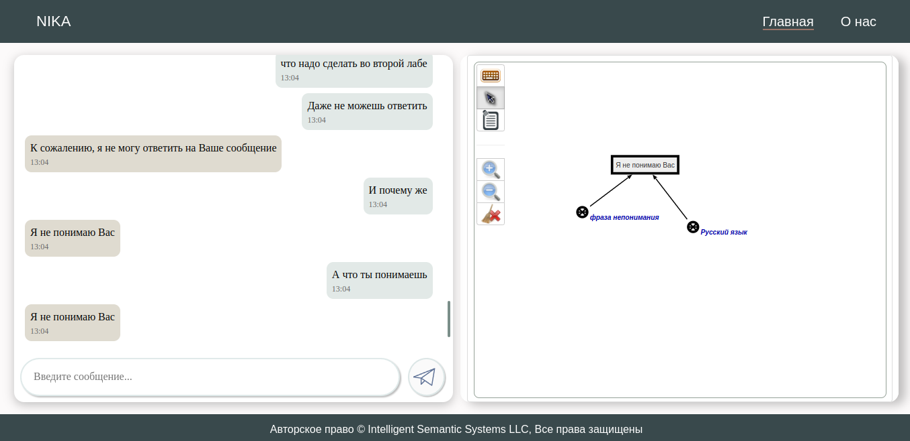

<p align="center"> Министерство образования Республики Беларусь</p>
<p align="center">Учреждение образования</p>
<p align="center">“Брестский Государственный технический университет”</p>
<p align="center">Кафедра ИИТ</p>
<br><br><br><br><br><br><br>
<p align="center">Лабораторная работа №4</p>
<p align="center">По дисциплине “Общая теория интеллектуальных систем”</p>
<p align="center">Тема: “Работа с проектом "NIKA" (Intelligent Knowledge-driven Assistant)”</p>
<br><br><br><br><br>
<p align="right">Выполнил:</p>
<p align="right">Студент 2 курса</p>
<p align="right">Группы ИИ-26</p>
<p align="right">Ерошин Е. А.</p>
<p align="right">Проверил:</p>
<p align="right">Иванюк Д. С.</p>
<br><br><br><br><br>
<p align="center">Брест 2024</p>

<hr>
# Общее задание 

1.  Изучить руководство.

2.  Запустить данный проект на локальной машине (домашний персональный компьютер, ноутбук, рабочая машина в аудитории и т.п.). Продемонстрировать работу проекта преподавателю.

3.  Написать отчет по выполненной работе в .md формате (readme.md) и с помощью pull request разместить его в следующем каталоге: trunk\ii0xxyy\task_04\doc.

# Установка 

# Запуск
```
docker compose up --no-build
```
Эта команда запуcкает 2 веб-интерфейса:

  ```localhost:8000```

  ```localhost:3033```
  
# Работа




# Проект **NIKA** (Intelligent Knowledge-driven Assistant)

## Описание проекта

**NIKA** (Intelligent Knowledge-driven Assistant) — это интеллектуальный ассистент, разработанный для поддержки пользователей в управлении знаниями, анализе данных и автоматизации задач. Проект объединяет технологии обработки естественного языка (NLP), машинного обучения и знаний домена, чтобы предоставлять рекомендации, отвечать на вопросы и помогать принимать решения на основе доступной информации.
---
## Примеры использования

1. **Интеллектуальный помощник для бизнеса**:
   - Автоматизация создания отчетов.
   - Генерация рекомендаций по оптимизации процессов.
2. **Образовательный ассистент**:
   - Ответы на вопросы студентов.
   - Создание учебных планов.
3. **Анализ больших данных**:
   - Обработка данных из разных источников.
   - Выявление ключевых инсайтов.

---

## Как начать работу

### Установка
1. Клонируйте репозиторий:
   ```bash
   git clone https://github.com/your-repo/nika.git
