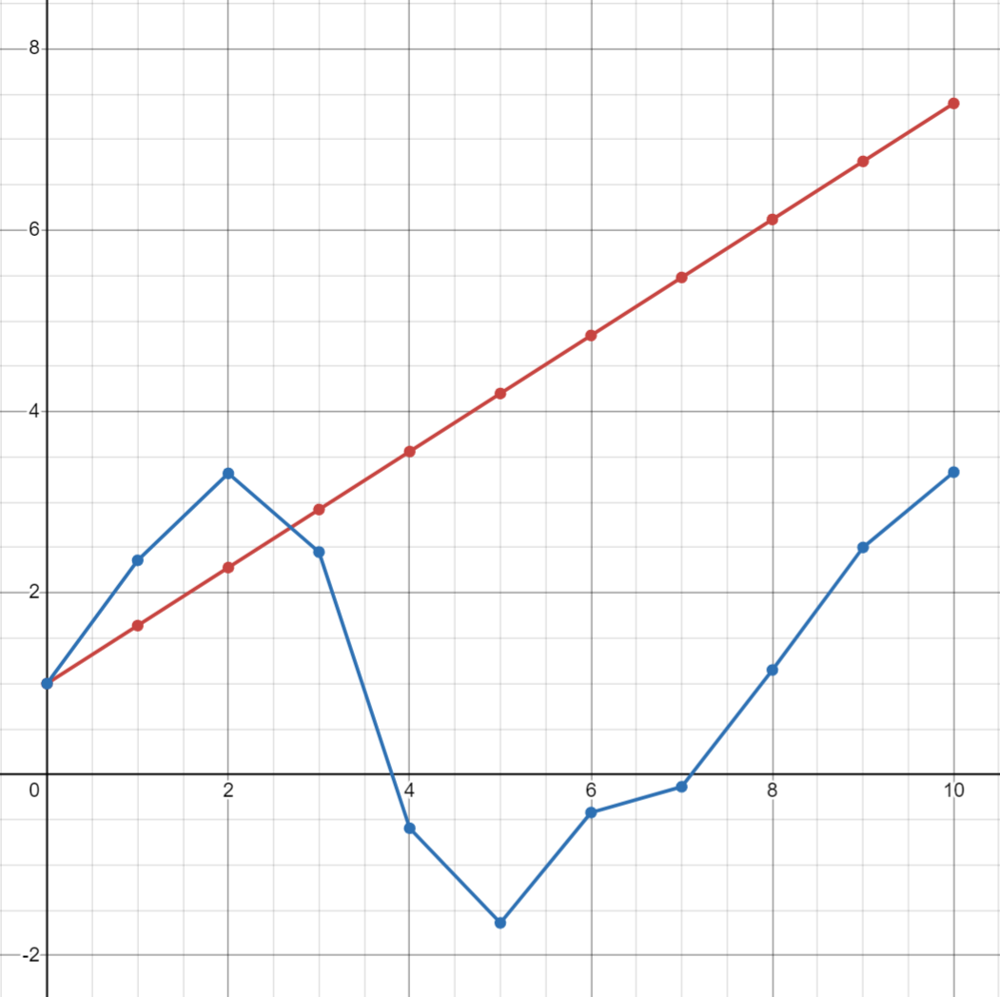

<p align="center"> Министерство образования Республики Беларусь</p>
<p align="center">Учреждение образования</p>
<p align="center">“Брестский Государственный технический университет”</p>
<p align="center">Кафедра ИИТ</p>
<br><br><br><br><br><br><br>
<p align="center">Лабораторная работа №1</p>
<p align="center">По дисциплине “Общая теория интеллектуальных систем”</p>
<p align="center">Тема: “Моделирования температуры объекта”</p>
<br><br><br><br><br>
<p align="right">Выполнил:</p>
<p align="right">Студент 2 курса</p>
<p align="right">Группы ИИ-26</p>
<p align="right">Вирко Е.Д.</p>
<p align="right">Проверила:</p>
<p align="right">Ситковец Я. С.</p>
<br><br><br><br><br>
<p align="center">Брест 2024</p>

<hr>

# Общее задание #
1. Написать отчет по выполненной лабораторной работе №1 в .md формате (readme.md) и с помощью запроса на внесение изменений (**pull request**) разместить его в следующем каталоге: **trunk\ii0xxyy\task_01\doc** (где **xx** - номер группы, **yy** - номер студента, например **ii02102**).
2. Исходный код написанной программы разместить в каталоге: **trunk\ii0xxyy\task_01\src**.
## Task 1. Modeling controlled object ##
Let's get some object to be controlled. We want to control its temperature, which can be described by this differential equation:

$$\Large\frac{dy(\tau)}{d\tau}=\frac{u(\tau)}{C}+\frac{Y_0-y(\tau)}{RC} $$ (1)

where $\tau$ – time; $y(\tau)$ – input temperature; $u(\tau)$ – input warm; $Y_0$ – room temperature; $C,RC$ – some constants.

After transformation, we get these linear (2) and nonlinear (3) models:

$$\Large y_{\tau+1}=ay_{\tau}+bu_{\tau}$$ (2)
$$\Large y_{\tau+1}=ay_{\tau}-by_{\tau-1}^2+cu_{\tau}+d\sin(u_{\tau-1})$$ (3)

where $\tau$ – time discrete moments ($1,2,3{\dots}n$); $a,b,c,d$ – some constants.

Task is to write program (**С++**), which simulates this object temperature.

<hr>

# Выполнение задания #

Код программы:
```C++
#include <iostream>
#include <cmath>
#include <vector>

using namespace std;

const double coefficients[] = { 0.8, 0.6, 0.4, 2.2 }; // Коэффициенты для моделирования
const double u = 0.8;

// Функция для расчета линейной модели
vector<double> calculateLinearModel(int steps, double initialTemperature) {
    vector<double> results(steps);
    results[0] = initialTemperature; // Устанавливаем начальное значение

    for (int t = 1; t < steps; ++t) {
        results[t] = coefficients[0] * results[t - 1] + coefficients[1] * u; // Формула линейной модели
    }
    return results;
}

// Функция для расчета нелинейной модели
vector<double> calculateNonlinearModel(int steps, double initialTemperature) {
    vector<double> results(steps);
    results[0] = initialTemperature; // Устанавливаем начальное значение

    if (steps > 1) {
        results[1] = coefficients[0] * results[0] + coefficients[2] * u + coefficients[3] * sin(u); // Вычисляем y1 для второго шага
    }

    for (int t = 2; t < steps; ++t) {
        results[t] = coefficients[0] * results[t - 1] - coefficients[1] * pow(results[t - 2], 2)
            + coefficients[2] * u + coefficients[3] * sin(u); // Формула нелинейной модели
    }
    return results;
}

int main() {
    setlocale(LC_ALL, "Russian");
    double initialTemperature; // Переменная для начальной температуры
    int steps; // Переменная для количества шагов

    // Ввод данных
    cout << "Добро пожаловать в программу моделирования!\n";
    cout << "Пожалуйста, введите начальную температуру: ";
    cin >> initialTemperature;

    cout << "Введите количество шагов (целое положительное число): ";
    cin >> steps;

    // Проверка на корректность ввода количества шагов
    while (steps <= 0) {
        cout << "Количество шагов должно быть положительным. Попробуйте снова: ";
        cin >> steps;
    }

    // Расчет результатов
    vector<double> linearResults = calculateLinearModel(steps + 1, initialTemperature);
    vector<double> nonlinearResults = calculateNonlinearModel(steps + 1, initialTemperature);

    // Вывод результатов для линейной модели
    cout << "\n--- Результаты линейной модели ---\n";
    for (int t = 0; t <= steps; ++t) {
        cout << "Шаг " << t << ": " << linearResults[t] << "\n";
    }

    // Вывод результатов для нелинейной модели
    cout << "\n--- Результаты нелинейной модели ---\n";
    for (int t = 0; t <= steps; ++t) {
        cout << "Шаг " << t << ": " << nonlinearResults[t] << "\n";
    }

    return 0;
}
```     
```
Добро пожаловать в программу моделирования!
Пожалуйста, введите начальную температуру: 25
Введите количество шагов (целое положительное число): 10

--- Результаты линейной модели ---
Шаг 0: 25
Шаг 1: 20.48
Шаг 2: 16.864
Шаг 3: 13.9712
Шаг 4: 11.657
Шаг 5: 9.80557
Шаг 6: 8.32445
Шаг 7: 7.13956
Шаг 8: 6.19165
Шаг 9: 5.43332
Шаг 10: 4.82666

--- Результаты нелинейной модели ---
Шаг 0: 25
Шаг 1: 21.8982
Шаг 2: -355.583
Шаг 3: -570.287
Шаг 4: -76318
Шаг 5: -256189
Шаг 6: -3.49487e+09
Шаг 7: -4.21755e+10
Шаг 8: -7.32846e+18
Шаг 9: -1.07312e+21
Шаг 10: -3.22238e+37

