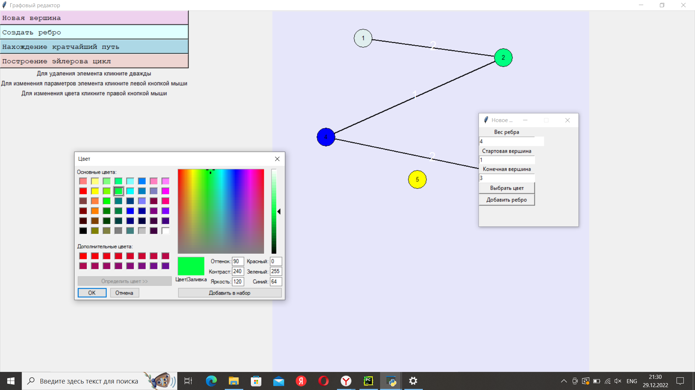
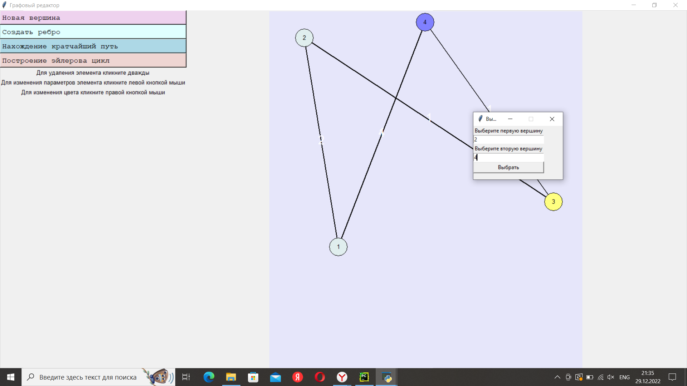


Министерство образования Республики Беларусь

Учреждение образования

«Брестский государственный технический университет»

Кафедра ИИТ

     

Лабораторная работа №3

За третий семестр

По дисциплине: «Общая теория интеллектуальных систем»

Тема: «Разработка редакторов графов»

     

Выполнила:

Студент 2 курса

Группы ИИ-26

Вирко Е.Д.

  

Проверил:

Иванюк Д.С.

Брест 2024  

--
# В работе было реализованно: #
1. Разработка и реализация программного продукта позволяющего
редактировать графовые конструкции различных видов и производить над
ними различные действия.

2. Редактор позволяет:  
  a) одновременно работать с несколькими графами (MDI);  
  b) **[\*]** выделение одновременно нескольких элементов графа, копирование
выделенного фрагмента в clipboard и восстановление из него;  
  c) задавать имена графам;  
  d) сохранять и восстанавливать граф во внутреннем формате программы;  
  e) экспортировать и импортировать граф в текстовый формат (описание
см. ниже);  
  f) создавать, удалять, именовать, переименовывать, перемещать узлы;  
  g) создавать неориентированные дуги, удалять дуги;  
  h) добавлять, удалять и редактировать содержимое узла (содержимое в
виде текста и ссылки на файл);  
  i) задавать цвет дуги и узла, образ узла;  
  j) **[\*]** создавать и отображать петли;  
  k) **[\*]** создавать и отображать кратные дуги.

3. Программный продукт позволяет выполнять следующие операции:  
  a) выводить информацию о графе;
  b) поиск всех путей (маршрутов) между двумя узлами и кратчайших;  
  c) вычисление расстояния между двумя узлами;    
  d) **[\*]** раскраска графа;  
  e) нахождения эйлеровых циклов.  

4. Отчет по выполненной лабораторной работе в .md формате (readme.md). Разместить его в следующем каталоге: **trunk\ii0xxyy\task_03\doc** (где **xx** - номер группы, **yy** - номер студента, например **ii02302**). 

5. Исходный код разработанной программы разместить в каталоге: **trunk\ii002601\task_03\src\otis3.cpp

'''C++
#include <iostream>
#include <queue>
#include <vector>

using namespace std;

struct Node {
    int id;
    vector<int> neighbors;
};

class Graph {
public:
    vector<Node> nodes;

    void addNode(int id) {
        nodes.push_back({id, {}});
    }

    void addEdge(int start, int end) {
        nodes[start].neighbors.push_back(end);
        nodes[end].neighbors.push_back(start);
    }

    void displayGraph() const {
        for (const auto& node : nodes) {
            cout << "Node " << node.id << ": ";
            for (int neighbor : node.neighbors) {
                cout << neighbor << " ";
            }
            cout << endl;
        }
    }

    vector<int> findEulerianCycle() const {
        if (!isEulerian()) {
            return {};
        }

        vector<int> cycle;
        vector<bool> visitedNodes(nodes.size(), false);
        int startNode = 0;

        dfsEulerianCycle(startNode, visitedNodes, cycle);

        return cycle;
    }

    vector<int> findHamiltonianCycle() {
        vector<int> cycle(nodes.size(), -1);
        vector<bool> visited(nodes.size(), false);
        cycle[0] = 0;
        visited[0] = true;

        if (hamiltonianHelper(0, 1, cycle, visited)) {
            return cycle;
        }
        return {};
    }

    Graph generateSpanningTree() const {
        Graph spanningTree;
        for (const auto& node : nodes) {
            spanningTree.addNode(node.id);
        }

        vector<bool> visited(nodes.size(), false);
        queue<int> q;
        q.push(0);
        visited[0] = true;

        while (!q.empty()) {
            int current = q.front();
            q.pop();

            for (int neighbor : nodes[current].neighbors) {
                if (!visited[neighbor]) {
                    visited[neighbor] = true;
                    spanningTree.addEdge(current, neighbor);
                    q.push(neighbor);
                }
            }
        }

        return spanningTree;
    }

private:
    bool isEulerian() const {
        for (const auto& node : nodes) {
            if (node.neighbors.size() % 2 != 0) {
                return false;
            }
        }
        return true;
    }

    void dfsEulerianCycle(int node, vector<bool>& visited, vector<int>& cycle) const {
        visited[node] = true;
        cycle.push_back(node);

        for (int neighbor : nodes[node].neighbors) {
            if (!visited[neighbor]) {
                dfsEulerianCycle(neighbor, visited, cycle);
            }
        }
    }

    bool hamiltonianHelper(int current, int depth, vector<int>& cycle, vector<bool>& visited) {
        if (depth == nodes.size()) {
            // Check if it forms a cycle
            for (int neighbor : nodes[current].neighbors) {
                if (neighbor == cycle[0]) {
                    return true;
                }
            }
            return false;
        }

        for (int neighbor : nodes[current].neighbors) {
            if (!visited[neighbor]) {
                visited[neighbor] = true;
                cycle[depth] = neighbor;

                if (hamiltonianHelper(neighbor, depth + 1, cycle, visited)) {
                    return true;
                }

                visited[neighbor] = false;
            }
        }

        return false;
    }
};

int main() {
    Graph graph;

    for (int i = 0; i < 5; ++i) {
        graph.addNode(i);
    }

    graph.addEdge(0, 1);
    graph.addEdge(1, 2);
    graph.addEdge(2, 3);
    graph.addEdge(3, 4);
    graph.addEdge(4, 0);

    cout << "Graph structure:" << endl;
    graph.displayGraph();

    vector<int> eulerianCycle = graph.findEulerianCycle();
    if (!eulerianCycle.empty()) {
        cout << "Eulerian cycle: ";
        for (int node : eulerianCycle) {
            cout << node << " ";
        }
        cout << endl;
    } else {
        cout << "No Eulerian cycle found." << endl;
    }

    vector<int> hamiltonianCycle = graph.findHamiltonianCycle();
    if (!hamiltonianCycle.empty()) {
        cout << "Hamiltonian cycle: ";
        for (int node : hamiltonianCycle) {
            cout << node << " ";
        }
        cout << endl;
    } else {
        cout << "No Hamiltonian cycle found." << endl;
    }

    Graph spanningTree = graph.generateSpanningTree();
    cout << "Spanning tree:" << endl;
    spanningTree.displayGraph();

    return 0;
}
'''

