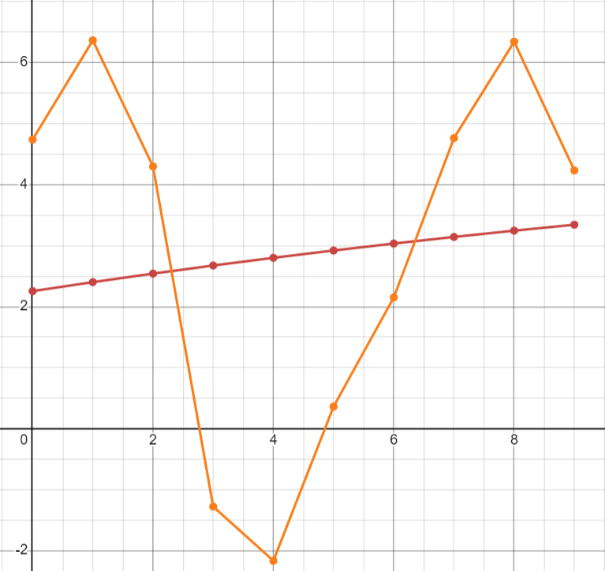

<p align="center"> Министерство образования Республики Беларусь</p>
<p align="center">Учреждение образования</p>
<p align="center">“Брестский Государственный технический университет”</p>
<p align="center">Кафедра ИИТ</p>
<br><br><br><br><br><br><br>
<p align="center">Лабораторная работа №1</p>
<p align="center">По дисциплине “Общая теория интеллектуальных систем”</p>
<p align="center">Тема: “Моделирования температуры объекта”</p>
<br><br><br><br><br>
<p align="right">Выполнил:</p>
<p align="right">Студент 2 курса</p>
<p align="right">Группы ИИ-26</p>
<p align="right">Рулько М. А.</p>
<p align="right">Проверил:</p>
<p align="right">Ситковец А. А.</p>
<br><br><br><br><br>
<p align="center">Брест 2024</p>

<hr>

# Общее задание #
1. Написать отчет по выполненной лабораторной работе №1 в .md формате (readme.md) и с помощью запроса на внесение изменений (**pull request**) разместить его в следующем каталоге: **trunk\ii0xxyy\task_01\doc** (где **xx** - номер группы, **yy** - номер студента, например **ii02102**).
2. Исходный код написанной программы разместить в каталоге: **trunk\ii0xxyy\task_01\src**.
## Task 1. Modeling controlled object ##
Let's get some object to be controlled. We want to control its temperature, which can be described by this differential equation:

$$\Large\frac{dy(\tau)}{d\tau}=\frac{u(\tau)}{C}+\frac{Y_0-y(\tau)}{RC} $$ (1)

where $\tau$ – time; $y(\tau)$ – input temperature; $u(\tau)$ – input warm; $Y_0$ – room temperature; $C,RC$ – some constants.

After transformation, we get these linear (2) and nonlinear (3) models:

$$\Large y_{\tau+1}=ay_{\tau}+bu_{\tau}$$ (2)
$$\Large y_{\tau+1}=ay_{\tau}-by_{\tau-1}^2+cu_{\tau}+d\sin(u_{\tau-1})$$ (3)

where $\tau$ – time discrete moments ($1,2,3{\dots}n$); $a,b,c,d$ – some constants.

Task is to write program (**Julia**), which simulates this object temperature.

<hr>

# Выполнение задания #

Код программы:
```C++
#include <iostream>
#include <cmath>

using namespace std;

const double коэффициент_a = 1.0;
const double коэффициент_b = 0.5;
const double коэффициент_c = 0.1;
const double коэффициент_d = 0.9;
const double U = 1.5;

void процессЛинейка(double& длина, int итерации);
void процессНеЛинейка(double& температура, int итерации);

int main() {
    setlocale(LC_ALL, "rus");
    double начальнаяТемпература = 0;

    cout << "какая начальная температура? ";
    cin >> начальнаяТемпература;

    // Процесс линейной модели
    процессЛинейка(начальнаяТемпература, 10);

    // Процесс нелинейной модели
    процессНеЛинейка(начальнаяТемпература, 10);

    return 0;
}

void процессЛинейка(double& длина, int итерации) {
    cout << "линейная модель:" << endl;
    for (int i = 0; i < итерации; i++) {
        длина = коэффициент_a * длина + коэффициент_b * U;
        cout << "////" << длина << "////" << endl;
    }
}

void процессНеЛинейка(double& температура, int итерации) {
    double предыдущаяТемпература = температура;
    bool перваяИтерация = true;

    cout << "нелинейная модель:" << endl;
    for (int i = 0; i < итерации; i++) {
        if (перваяИтерация) {
            температура = коэффициент_a * температура + коэффициент_c * U + коэффициент_d * sin(U);
            перваяИтерация = false;
        } else {
            double новаяТемпература = коэффициент_a * температура - коэффициент_b * pow(предыдущаяТемпература, 2) + коэффициент_c * U + коэффициент_d * sin(U);
            предыдущаяТемпература = температура;
            температура = новаяТемпература;
        }
        cout << "////" << температура << "////" << endl;
    }
}
```     
```
Вывод программы:
какая начальная температура?10
линейная модель:
////10.75////
////11.5////
////12.25////
////13////
////13.75////
////14.5////
////15.25////
////16////
////16.75////
////17.5////
нелинейная модель:
////11.0477////
////-37.9045////
////-97.8831////
////-815.211////
////-5604.71////
////-337888////
////-1.60443e+07////
////-5.71003e+10////
////-1.28767e+14////
////-1.63022e+21////


