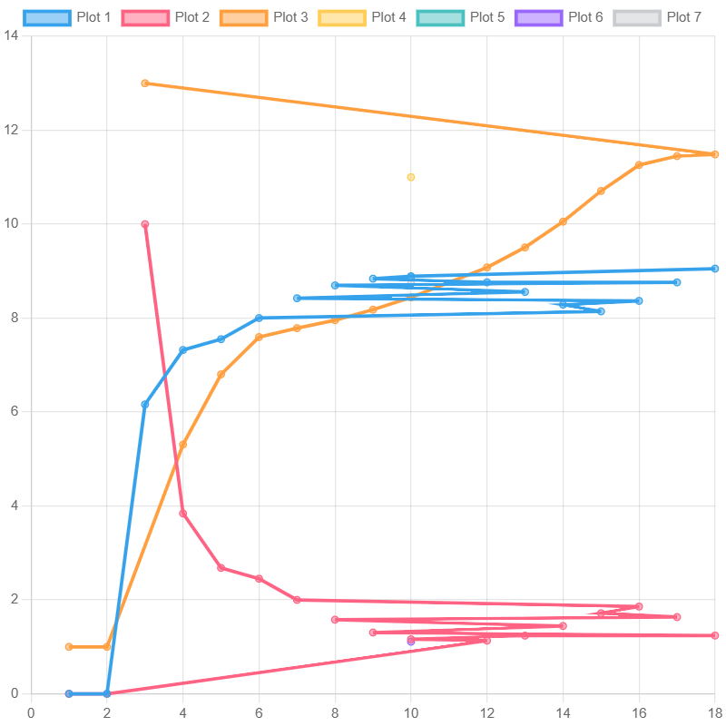

<p align="center"> Министерство образования Республики Беларусь</p>
<p align="center">Учреждение образования</p>
<p align="center">“Брестский Государственный технический университет”</p>
<p align="center">Кафедра ИИТ</p>
<br><br><br><br><br><br><br>
<p align="center">Лабораторная работа №2</p>
<p align="center">По дисциплине “Общая теория интеллектуальных систем”</p>
<p align="center">Тема: “ПИД-регуляторы”</p>
<br><br><br><br><br>
<p align="right">Выполнил:</p>
<p align="right">Студент 2 курса</p>
<p align="right">Группы ИИ-25</p>
<p align="right">Гродзинский</p>
<p align="right">Проверил:</p>
<p align="right">Ситковец Я. С.</p>
<br><br><br><br><br>
<p align="center">Брест 2024</p>

<hr>

# Общее задание #
1. Написать отчет по выполненной лабораторной работе №1 в .md формате (readme.md) и с помощью запроса на внесение изменений (**pull request**) разместить его в следующем каталоге: **trunk\ii0xxyy\task_02\doc** (где **xx** - номер группы, **yy** - номер студента, например **ii02302**).
2. Исходный код написанной программы разместить в каталоге: **trunk\ii0xxyy\task_02\src**.

# Задание #
Задание. На C++ реализовать программу, моделирующую рассмотренный выше ПИД-регулятор. В качестве объекта управления использовать математическую модель, полученную в предыдущей работе. В отчете также привести графики для разных заданий температуры объекта, пояснить полученные результаты.


<hr>

# Выполнение задания #

Код программы:
```C++
#include <iostream>
#include <vector>
#include <iomanip>

using namespace std;

int main() {
    // Определение констант
    float alpha = 0.9, beta = 0.4, gamma = 0.45, delta = 0.74;
    float K = 0.9, initial_time = 0.3, sample_time = 1.0, delay_time = 0.1, output = 10.0;

    // Калкулирование начальных условий
    float q0 = K * (1 + (delay_time / initial_time)), q1 = -K * (1 + 2 * (delay_time / initial_time) - (initial_time / sample_time)), q2 = K * (delay_time / initial_time);

    // Инициализация массивов
    const short int n_iterations = 2;
    vector<float> result(n_iterations, 0.0);
    vector<float> error(n_iterations, 0.0);
    vector<float> control(n_iterations, 1.0);

    // Установка русского языка для вывода
    setlocale(LC_ALL, "RUSSIAN");

    // Главный цикл
    while (abs(output - result.back()) > 1) {
        // Калкулирование ошибки
        error.push_back(output - result.back());

        // Калкулирование контроля
        float new_control = control.back() + q0 * error.back() + q1 * error[error.size() - 2] + q2 * error[error.size() - 3];
        control.push_back(new_control);

        // Калкулирование нового результата
        result.push_back(alpha * result.back() - beta * result[result.size() - 2] + gamma * control.back() + delta * sin(control.back()));
    }

    // Вывод результатов
    cout << right << setw(9) << "Итерация" << setw(9) << right << "Выход" << setw(12) << right << "Ошибка" << setw(12) << right << "Контроль" << endl;
    for (int i = 0; i < result.size(); i++) {
        cout << right << setw(9) << i + 1 << setw(9) << result[i] << setw(12) << error[i] << setw(12) << control[i] << endl;
    }

    return 0;
}
'''
Вывод:
'''
Итерация    Выход      Ошибка    Контроль
        1        0           0           1
        2        0           0           1
        3  6.16092          10          13
        4   7.3199     3.83908     5.30689
        5  7.55022      2.6801     6.80095
        6  8.00088     2.44978     7.59588
        7  8.42251     1.99912     7.78563
        8  8.69575     1.57749     7.95464
        9  8.83901     1.30425     8.17916
       10   8.8914     1.16099     8.44137
       11  8.86832      1.1086     8.73495
       12  8.76161     1.13168     9.07768
       13  8.55626     1.23839     9.50436
       14  8.28491     1.44374     10.0531
       15  8.14266     1.71509      10.707
       16  8.36672     1.85734     11.2593
       17  8.76001     1.63328     11.4493
       18  9.05286     1.23999     11.4855
'''
