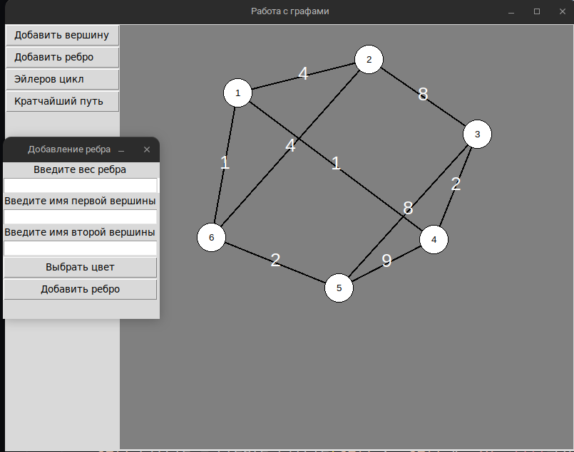
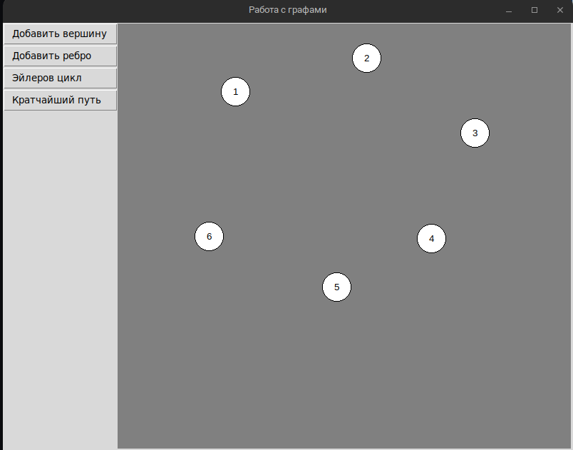
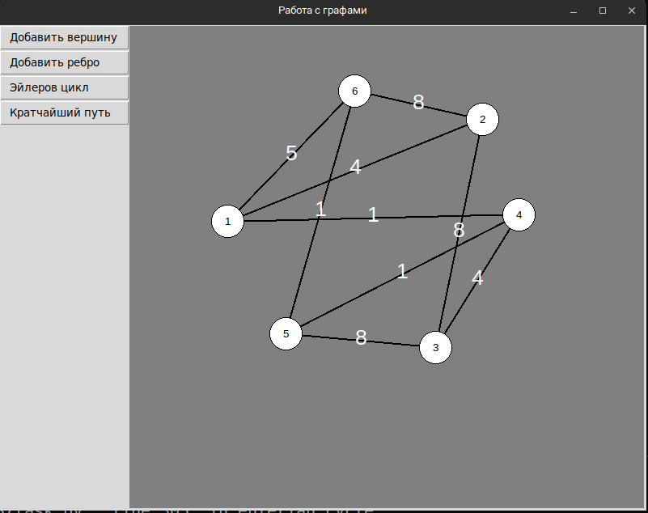

<p align="center"> Министерство образования Республики Беларусь</p>
<p align="center">Учреждение образования</p>
<p align="center">“Брестский Государственный технический университет”</p>
<p align="center">Кафедра ИИТ</p>
<br><br><br><br><br><br><br>
<p align="center">Лабораторная работа №3</p>
<p align="center">По дисциплине “Общая теория интеллектуальных систем”</p>
<p align="center">Тема: “Применение знаний алгоритмов для графов на практике”</p>
<br><br><br><br><br>
<p align="right">Выполнил:</p>
<p align="right">Студент 2 курса</p>
<p align="right">Группы ИИ-25</p>
<p align="right">Гродзинский А.Д.</p>
<p align="right">Проверила:</p>
<p align="right">Ситковец Я.С.</p>
<br><br><br><br><br>
<p align="center">Брест 2024</p>

---

# Общее задание #
1. Разработать и реализовать программный продукт позволяющий
редактировать графовые конструкции различных видов и производить над
ними различные действия. Язык программирования - любой.

2. Редактор должен позволять (задания со **[\*]** являются необязательными):  
  a) одновременно работать с несколькими графами (MDI);  
  b) **[\*]** выделение одновременно нескольких элементов графа, копирование
выделенного фрагмента в clipboard и восстановление из него;  
  c) задавать имена графам;  
  d) сохранять и восстанавливать граф во внутреннем формате программы;  
  e) экспортировать и импортировать граф в текстовый формат (описание
см. ниже);  
  f) создавать, удалять, именовать, переименовывать, перемещать узлы;  
  g) создавать ориентированные и неориентированные дуги, удалять дуги;  
  h) добавлять, удалять и редактировать содержимое узла (содержимое в
виде текста и ссылки на файл);  
  i) задавать цвет дуги и узла, образ узла;  
  j) **[\*]** создавать и отображать петли;  
  k) **[\*]** создавать и отображать кратные дуги.

3. Программный продукт должен позволять выполнять следующие операции:  
  a) выводить информацию о графе:

 + количество вершин, дуг;
 + степени для всех вершин и для выбранной вершины;
 + матрицу инцидентности;
 + матрицу смежности;
 + является ли он деревом, полным, связанным, эйлеровым, **[\*]** планарным;

  b) поиск всех путей (маршрутов) между двумя узлами и кратчайших;  
  c) вычисление расстояния между двумя узлами;  
  d) вычисление диаметра, радиуса, центра графа;  
  e) **[\*]** вычисление векторного и декартово произведения двух графов;  
  f) **[\*]** раскраска графа;  
  g) нахождения эйлеровых, [*] гамильтоновых циклов;  
  h) **[\*]** поиск подграфа в графе, со всеми или некоторыми неизвестными
узлами;  
  i) **[\*]** поиск узла по содержимому;  
  j) **[\*]** объединение, пересечение, сочетание и дополнение графов;  
  k) **[\*]** приведение произвольного графа к определенному типу с
минимальными изменениями:

 + бинарное и обычное дерево;
 + полный граф;
 + планарный граф;
 + связанный граф;

4. Формат текстового представления графа:
<ГРАФ> ::= <ИМЯ ГРАФА> : UNORIENT | ORIENT ; <ОПИСАНИЕ УЗЛОВ> ;
<ОПИСАНИЕ СВЯЗЕЙ> .
<ИМЯ ГРАФА> ::= <ИДЕНТИФИКАТОР>
<ОПИСАНИЕ УЗЛОВ> ::= <ИМЯ УЗЛА> [ , <ИМЯ УЗЛА> …]
<ИМЯ УЗЛА> ::= <ИДЕНТИФИКАТОР>
<ОПИСАНИЕ СВЯЗЕЙ> ::= <ИМЯ УЗЛА> -> <ИМЯ УЗЛА> [ , <ИМЯ УЗЛА> …] ;
[<ОПИСАНИЕ СВЯЗЕЙ> …]

5. Написать отчет по выполненной лабораторной работе в .md формате (readme.md). Разместить его в следующем каталоге: **trunk\ii0xxyy\task_03\doc** (где **xx** - номер группы, **yy** - номер студента, например **ii02102**). 

6. Исходный код разработанной программы разместить в каталоге: **trunk\ii0xxyy\task_03\src**.

---

# Выполнение задания #
```#include <iostream>
#include <string>
#include <unordered_map>
#include <vector>
#include <fstream>
#include <limits>
#include <iomanip>
#include <algorithm>

class Node {
public:
    std::string id;       // Идентификатор узла
    std::string data;     // Хранит текстовое содержимое
    std::string link;     // Ссылка на связанный файл

    Node() = default; // Конструктор по умолчанию
    Node(const std::string& nodeId) : id(nodeId) {} // Конструктор с параметром
};

class Connection {
public:
    std::string startNode; // Начальный узел
    std::string endNode;   // Конечный узел
    bool isDirected;       // Флаг направленности соединения

    Connection(const std::string& start, const std::string& end, bool directed = false)
        : startNode(start), endNode(end), isDirected(directed) {}
};

class NetworkGraph {
public:
    std::string graphName;      // Название графа
    bool directedGraph;         // Является ли граф направленным
    std::unordered_map<std::string, Node> theNodes;  // Словарь узлов
    std::vector<Connection> theConnections;            // Вектор соединений

    // Конструктор для создания нового графа
    NetworkGraph(const std::string& name, bool isDirected)
        : graphName(name), directedGraph(isDirected) {}

    // Метод для добавления узла
    void addNode(const std::string& nodeId) {
        if (theNodes.find(nodeId) == theNodes.end()) { // Проверка существования узла
            theNodes[nodeId] = Node(nodeId);
            std::cout << "Узел " << nodeId << " успешно создан.\n";
        } else {
            std::cout << "Узел " << nodeId << " уже существует.\n";
        }
    }

    // Метод для удаления узла
    void removeNode(const std::string& nodeId) {
        if (theNodes.erase(nodeId)) { // Если узел был найден и удален
            // Удаление всех соединений, в которых участвует данный узел
            theConnections.erase(std::remove_if(theConnections.begin(), theConnections.end(), [&](Connection& conn) {
                return conn.startNode == nodeId || conn.endNode == nodeId;
            }), theConnections.end());

            std::cout << "Узел " << nodeId << " успешно удален.\n";
        } else {
            std::cout << "Узел " << nodeId << " не найден.\n";
        }
    }

    // Метод для добавления соединения между узлами
    void addConnection(const std::string& start, const std::string& end) {
        if (theNodes.find(start) != theNodes.end() && theNodes.find(end) != theNodes.end()) {
            theConnections.emplace_back(start, end, directedGraph);
            std::cout << "Соединение от " << start << " к " << end << " успешно добавлено.\n";
        } else {
            std::cout << "Один или оба узла отсутствуют.\n";
        }
    }

    // Метод для удаления соединения
    void removeConnection(const std::string& start, const std::string& end) {
        theConnections.erase(std::remove_if(theConnections.begin(), theConnections.end(), [&](Connection& conn) {
            return conn.startNode == start && conn.endNode == end;
        }), theConnections.end());
        std::cout << "Соединение от " << start << " к " << end << " успешно удалено.\n";
    }

    // Метод для сохранения графа в файл
    void saveGraphToFile(const std::string& fileName) {
        std::ofstream outFile(fileName);
        if (outFile.is_open()) {
            outFile << graphName << " : " << (directedGraph ? "DIRECTED" : "UNDIRECTED") << " ;\n";

            // Записываем узлы в файл
            for (const auto& nodePair : theNodes) {
                outFile << nodePair.first << " "; // Запись названия узла
            }
            outFile << ";\n";

            // Записываем соединения в файл
            for (const auto& conn : theConnections) {
                outFile << conn.startNode << " -> " << conn.endNode;
                // Учитываем направленность
                if (directedGraph) {
                    outFile << " ;";
                } else {
                    outFile << " ";
                }
            }

            outFile.close(); // Закрытие файла
            std::cout << "Граф успешно сохранен в " << fileName << "\n";
        } else {
            std::cout << "Ошибка при открытии файла для сохранения.\n";
        }
    }

    // Метод для загрузки графа из файла
    void loadGraphFromFile(const std::string& fileName) {
        std::ifstream inFile(fileName);
        if (inFile.is_open()) {
            theNodes.clear();       // Очистка узлов
            theConnections.clear();  // Очистка соединений

            std::string line;
            getline(inFile, line);  // Читаем название графа
            size_t pos = line.find(" : ");
            graphName = line.substr(0, pos);
            directedGraph = line.find("DIRECTED") != std::string::npos; // Определение направленности графа

            // Читаем узлы
            getline(inFile, line);
            pos = 0;
            while ((pos = line.find(' ')) != std::string::npos) {
                std::string nodeName = line.substr(0, pos);
                addNode(nodeName);
                line.erase(0, pos + 1);
            }
            if (!line.empty()) addNode(line); // Добавляем последний узел

            // Читаем соединения
            getline(inFile, line);
            while ((pos = line.find("->")) != std::string::npos) {
                std::string start = line.substr(0, pos);
                line.erase(0, pos + 2);
                pos = line.find(';');
                std::string end = line.substr(0, pos);
                addConnection(start, end);
                if (pos == std::string::npos) break;
                line.erase(0, pos + 1);
            }
            inFile.close(); // Закрываем файл
            std::cout << "Граф успешно загружен из " << fileName << "\n";
        } else {
            std::cout << "Ошибка при открытии файла для загрузки.\n";
        }
    }

    // Метод для отображения информации о графе
    void displayGraphInfo() {
        std::cout << "Название графа: " << graphName << "\n";
        std::cout << "Количество узлов: " << theNodes.size() << "\n";
        std::cout << "Количество соединений: " << theConnections.size() << "\n";
    }

    // Метод для визуализации графа в виде ASCII-арт
    void visualizeGraph() {
        std::cout << "\n--- ASCII Визуализация графа ---\n";
        for (const auto& conn : theConnections) {
            std::cout << std::setw(2) << conn.startNode << " --> " << conn.endNode << "\n"; // СМИ угловой осевой соединение
            if (!directedGraph) {
                std::cout << std::setw(2) << conn.endNode << " --> " << conn.startNode << "\n"; // Добавляем обратное соединение для несообрженного графа
            }
        }
        std::cout << "----------------------------------\n";
    }
};

// Функция для отображения меню
void showMainMenu() {
    std::cout << "\n--- Меню редактора графов ---\n";
    std::cout << "1. Создать узел\n";
    std::cout << "2. Удалить узел\n";
    std::cout << "3. Создать соединение\n";
    std::cout << "4. Удалить соединение\n";
    std::cout << "5. Показать информацию о графе\n";
    std::cout << "6. Сохранить граф в файл\n";
    std::cout << "7. Загрузить граф из файла\n";
    std::cout << "8. Визуализировать граф\n";
    std::cout << "9. Выход из приложения\n";
    std::cout << "Выберите опцию: ";
}

int main() {
    NetworkGraph myGraph("MyNetwork", true); // Создаем пример графа
    int userChoice;                          // Переменная для выбора пользователем
    std::string nodeName, startNode, endNode, fileName;

    while (true) {
        showMainMenu(); // Отображаем меню
        std::cin >> userChoice; // Получаем выбор пользователя
        std::cin.ignore(std::numeric_limits<std::streamsize>::max(), '\n'); // Очищаем буфер ввода

        switch (userChoice) {
        case 1: // Добавление узла
            std::cout << "Введите название узла: ";
            std::getline(std::cin, nodeName);
            myGraph.addNode(nodeName);
            break;

        case 2: // Удаление узла
            std::cout << "Введите название узла для удаления: ";
            std::getline(std::cin, nodeName);
            myGraph.removeNode(nodeName);
            break;

        case 3: // Добавление соединения
            std::cout << "Введите начальный узел: ";
            std::getline(std::cin, startNode);
            std::cout << "Введите конечный узел: ";
            std::getline(std::cin, endNode);
            myGraph.addConnection(startNode, endNode);
            break;

        case 4: // Удаление соединения
            std::cout << "Введите начальный узел для удаления соединения: ";
            std::getline(std::cin, startNode);
            std::cout << "Введите конечный узел для удаления соединения: ";
            std::getline(std::cin, endNode);
            myGraph.removeConnection(startNode, endNode);
            break;

        case 5: // Отображение информации о графе
            myGraph.displayGraphInfo();
            break;

        case 6: // Сохранение графа
            std::cout << "Введите имя файла для сохранения: ";
            std::getline(std::cin, fileName);
            myGraph.saveGraphToFile(fileName);
            break;

        case 7: // Загрузка графа
            std::cout << "Введите имя файла для загрузки: ";
            std::getline(std::cin, fileName);
            myGraph.loadGraphFromFile(fileName);
            break;

        case 8: // Визуализация графа
            myGraph.visualizeGraph();
            break;

        case 9: // Завершение работы программы
            std::cout << "Выход из программы.\n";
            return 0;

        default: // Обработка некорректного ввода
            std::cout << "Некорректный ввод. Попробуйте снова.\n";
            break;
        }
    }

    return 0; // Завершение программы
}
```










