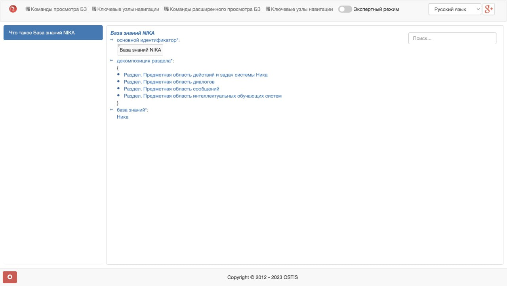
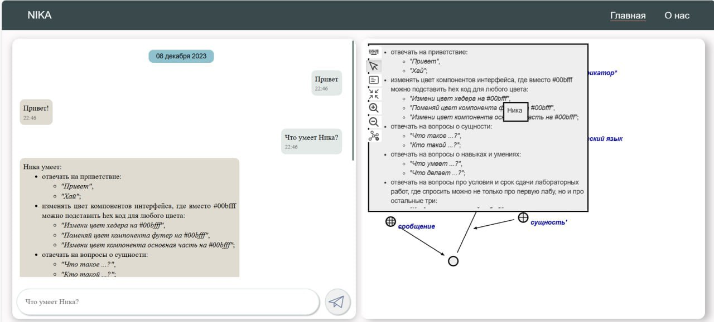
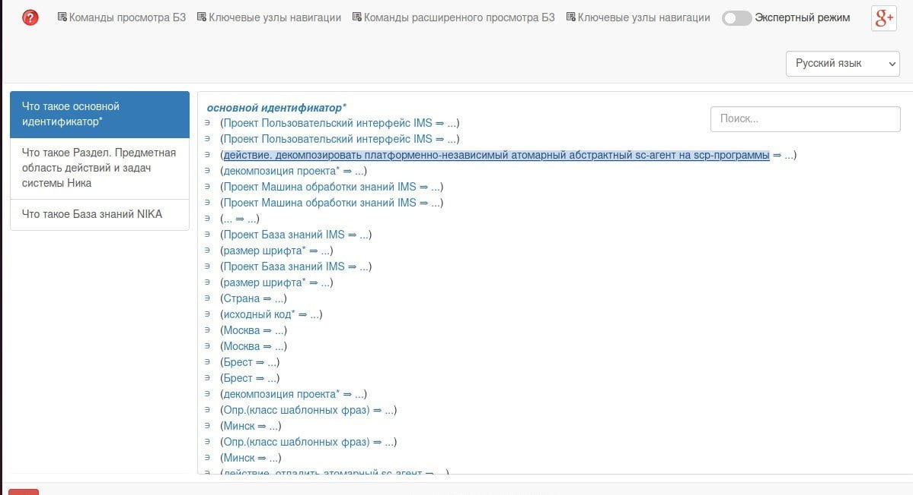
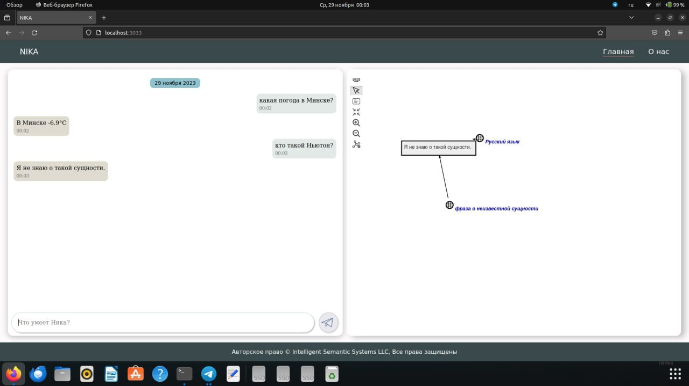

<p align="center"> Министерство образования Республики Беларусь</p>
<p align="center">Учреждение образования</p>
<p align="center">“Брестский Государственный технический университет”</p>
<p align="center">Кафедра ИИТ</p>
<br><br><br><br><br><br><br>
<p align="center">Лабораторная работа №4</p>
<p align="center">По дисциплине “Общая теория интеллектуальных систем”</p>
<p align="center">Тема: “Работа с проектом "NIKA" (Intelligent Knowledge-driven Assistant)”</p>
<br><br><br><br><br>
<p align="right">Выполнил:</p>
<p align="right">Студент</p>
<p align="right">Группы ИИ-25</p>
<p align="right">Котов В.В.</p>
<p align="right">Проверил:</p>
<p align="right">Иванюк Д.С.</p>
<br><br><br><br><br>
<p align="center">Брест 2024</p>

---

 Общее задание 

 # Работа с проектом **"NIKA"** (Intelligent Knowledge-driven Assistant) #
 
1. Ознакомьтесь с руководством по проекту и сделать соответствующие выводы для дальнейшей работы.(https://github.com/ostis-apps/nika).

2. Запустите проект на своем компьютере (будь то домашний ПК, ноутбук или рабочая станция в аудитории). Удостоверьтесь, что проект работает корректно и после чего, покажите преподавателю корректную работу проекта.

3. Составьте отчет о проделанной работе над проектом в формате .md (readme.md) и через pull request добавьте его в директорию trunk\ii0xxyy\task_04\doc (где xx - это номер группы, yy - порядковый номер в группе).


---


 Запуск:
```
docker compose up --no-build
```
Эта команда запустит два веб-интерфейса:

sc-web - ```localhost:8000```

dialogue web UI - ```localhost:3033```

 Результат:

Что такое Nika:




Что умеет Nika:




Основной идентификатор:




Общение:

