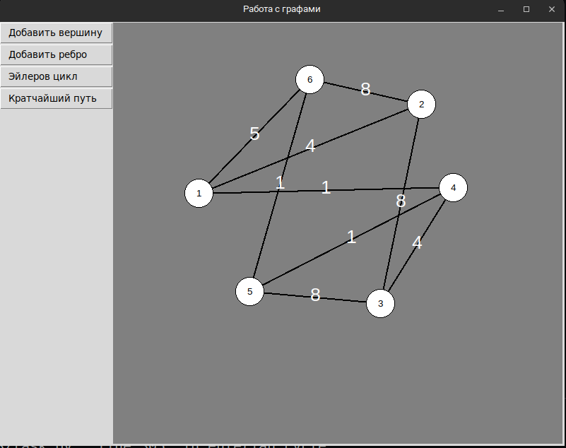

<p align="center"> Министерство образования Республики Беларусь</p>
<p align="center">Учреждение образования</p>
<p align="center">“Брестский Государственный технический университет”</p>
<p align="center">Кафедра ИИТ</p>
<br><br><br><br><br><br><br>
<p align="center">Лабораторная работа №3</p>
<p align="center">По дисциплине “Общая теория интеллектуальных систем”</p>
<p align="center">Тема: “Применение знаний алгоритмов для графов на практике”</p>
<br><br><br><br><br>
<p align="right">Выполнила:</p>
<p align="right">Студентка 2 курса</p>
<p align="right">Группы ИИ-25</p>
<p align="right">Подгайский Д.А.</p>
<p align="right">Проверила:</p>
<p align="right">Ситковец Я.С.</p>
<br><br><br><br><br>
<p align="center">Брест 2024</p>

---

# Общее задание #
1. Разработать и реализовать программный продукт позволяющий
редактировать графовые конструкции различных видов и производить над
ними различные действия. Язык программирования - любой.

2. Редактор должен позволять (задания со **[\*]** являются необязательными):  
  a) одновременно работать с несколькими графами (MDI);  
  b) **[\*]** выделение одновременно нескольких элементов графа, копирование
выделенного фрагмента в clipboard и восстановление из него;  
  c) задавать имена графам;  
  d) сохранять и восстанавливать граф во внутреннем формате программы;  
  e) экспортировать и импортировать граф в текстовый формат (описание
см. ниже);  
  f) создавать, удалять, именовать, переименовывать, перемещать узлы;  
  g) создавать ориентированные и неориентированные дуги, удалять дуги;  
  h) добавлять, удалять и редактировать содержимое узла (содержимое в
виде текста и ссылки на файл);  
  i) задавать цвет дуги и узла, образ узла;  
  j) **[\*]** создавать и отображать петли;  
  k) **[\*]** создавать и отображать кратные дуги.

3. Программный продукт должен позволять выполнять следующие операции:  
  a) выводить информацию о графе:

 + количество вершин, дуг;
 + степени для всех вершин и для выбранной вершины;
 + матрицу инцидентности;
 + матрицу смежности;
 + является ли он деревом, полным, связанным, эйлеровым, **[\*]** планарным;

  b) поиск всех путей (маршрутов) между двумя узлами и кратчайших;  
  c) вычисление расстояния между двумя узлами;  
  d) вычисление диаметра, радиуса, центра графа;  
  e) **[\*]** вычисление векторного и декартово произведения двух графов;  
  f) **[\*]** раскраска графа;  
  g) нахождения эйлеровых, [*] гамильтоновых циклов;  
  h) **[\*]** поиск подграфа в графе, со всеми или некоторыми неизвестными
узлами;  
  i) **[\*]** поиск узла по содержимому;  
  j) **[\*]** объединение, пересечение, сочетание и дополнение графов;  
  k) **[\*]** приведение произвольного графа к определенному типу с
минимальными изменениями:

 + бинарное и обычное дерево;
 + полный граф;
 + планарный граф;
 + связанный граф;

4. Формат текстового представления графа:
<ГРАФ> ::= <ИМЯ ГРАФА> : UNORIENT | ORIENT ; <ОПИСАНИЕ УЗЛОВ> ;
<ОПИСАНИЕ СВЯЗЕЙ> .
<ИМЯ ГРАФА> ::= <ИДЕНТИФИКАТОР>
<ОПИСАНИЕ УЗЛОВ> ::= <ИМЯ УЗЛА> [ , <ИМЯ УЗЛА> …]
<ИМЯ УЗЛА> ::= <ИДЕНТИФИКАТОР>
<ОПИСАНИЕ СВЯЗЕЙ> ::= <ИМЯ УЗЛА> -> <ИМЯ УЗЛА> [ , <ИМЯ УЗЛА> …] ;
[<ОПИСАНИЕ СВЯЗЕЙ> …]

5. Написать отчет по выполненной лабораторной работе в .md формате (readme.md). Разместить его в следующем каталоге: **trunk\ii0xxyy\task_03\doc** (где **xx** - номер группы, **yy** - номер студента, например **ii02102**). 

6. Исходный код разработанной программы разместить в каталоге: **trunk\ii0xxyy\task_03\src**.

---

# Выполнение задания #
```С++
#include <iostream>
#include <queue>
#include <vector>
using namespace std;

struct Vertex {
    int index;
    vector<int> neighbors;
};

class Graph {
public:
    vector<Vertex> vertices;

    void insert_vertex(int index) {
        vertices.push_back({ index, {} });
    }

    void connect_vertices(int from, int to) {
        vertices[from].neighbors.push_back(to);
        vertices[to].neighbors.push_back(from);
    }

    void display() {
        for (const auto& vertex : vertices) {
            cout << "Vertex " << vertex.index << ": ";
            for (int neighbor : vertex.neighbors) {
                cout << neighbor << " ";
            }
            cout << endl;
        }
    }

    vector<int> find_eulerian_cycle() {
        vector<int> path;
        if (!check_eulerian()) {
            return path;
        }
        vector<bool> visited(vertices.size(), false);
        int initial = 0;

        path.push_back(initial);
        visited[initial] = true;

        int current = initial;
        while (!path.empty()) {
            bool found = false;
            for (int neighbor : vertices[current].neighbors) {
                if (!visited[neighbor]) {
                    found = true;
                    visited[neighbor] = true;
                    current = neighbor;
                    path.push_back(current);
                    break;
                }
            }
            if (!found) {
                path.pop_back();
                if (!path.empty()) {
                    current = path.back();
                }
            }
        }
        return path;
    }

    vector<int> find_hamiltonian_cycle() {
        vector<int> path;
        vector<bool> visited(vertices.size(), false);
        visited[0] = true;
        path.push_back(0);

        if (!solve_hamiltonian(0, 1, path, visited)) {
            path.clear();
        }
        return path;
    }

    Graph build_spanning_tree() {
        Graph tree;
        for (const auto& vertex : vertices) {
            tree.insert_vertex(vertex.index);
        }
        vector<bool> visited(vertices.size(), false);

        visited[0] = true;
        queue<int> queue;
        queue.push(0);

        while (!queue.empty()) {
            int current = queue.front();
            queue.pop();

            for (int neighbor : vertices[current].neighbors) {
                if (!visited[neighbor]) {
                    tree.connect_vertices(current, neighbor);
                    visited[neighbor] = true;
                    queue.push(neighbor);
                }
            }
        }
        return tree;
    }

private:
    bool check_eulerian() {
        for (const auto& vertex : vertices) {
            if (vertex.neighbors.size() % 2 != 0) {
                return false;
            }
        }
        return true;
    }

    bool solve_hamiltonian(int current, int depth, vector<int>& path, vector<bool>& visited) {
        if (depth == vertices.size()) {
            return true;
        }
        for (int neighbor : vertices[current].neighbors) {
            if (!visited[neighbor]) {
                visited[neighbor] = true;
                path.push_back(neighbor);
                if (solve_hamiltonian(neighbor, depth + 1, path, visited)) {
                    return true;
                }
                visited[neighbor] = false;
                path.pop_back();
            }
        }
        return false;
    }
};

int main() {
    setlocale(LC_ALL, "ru");
    Graph graph;

    graph.insert_vertex(0);
    graph.insert_vertex(1);
    graph.insert_vertex(2);
    graph.insert_vertex(3);
    graph.insert_vertex(4);

    graph.connect_vertices(0, 1);
    graph.connect_vertices(1, 2);
    graph.connect_vertices(2, 3);
    graph.connect_vertices(3, 4);
    graph.connect_vertices(4, 0);

    graph.display();

    vector<int> eulerianCycle = graph.find_eulerian_cycle();
    if (!eulerianCycle.empty()) {
        cout << "Eulerian cycle: ";
        for (int vertex : eulerianCycle) {
            cout << vertex << " ";
        }
        cout << endl;
    }
    else {
        cout << "No Eulerian cycle" << endl;
    }

    vector<int> hamiltonianCycle = graph.find_hamiltonian_cycle();
    if (!hamiltonianCycle.empty()) {
        cout << "Hamiltonian cycle: ";
        for (int vertex : hamiltonianCycle) {
            cout << vertex << " ";
        }
        cout << endl;
    }
    else {
        cout << "No Hamiltonian cycle" << endl;
    }

    Graph spanningTree = graph.build_spanning_tree();
    spanningTree.display();

    return 0;
}
```


