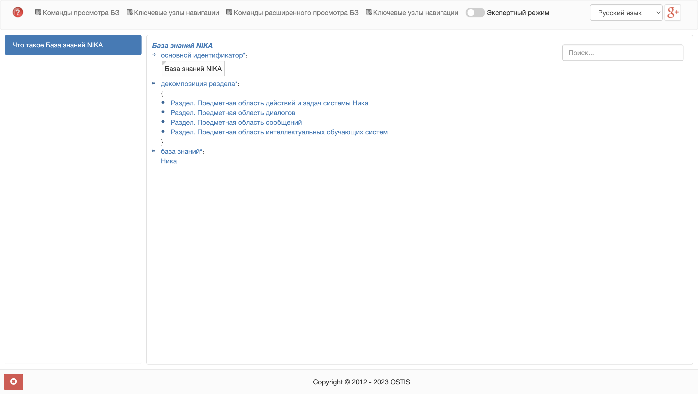
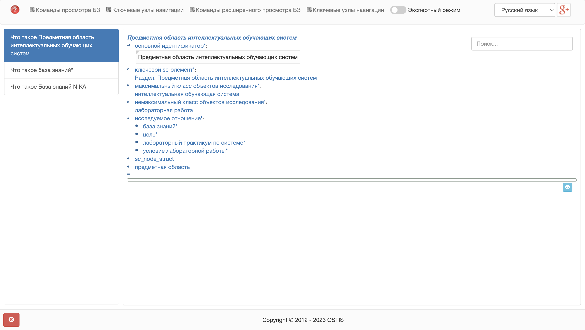
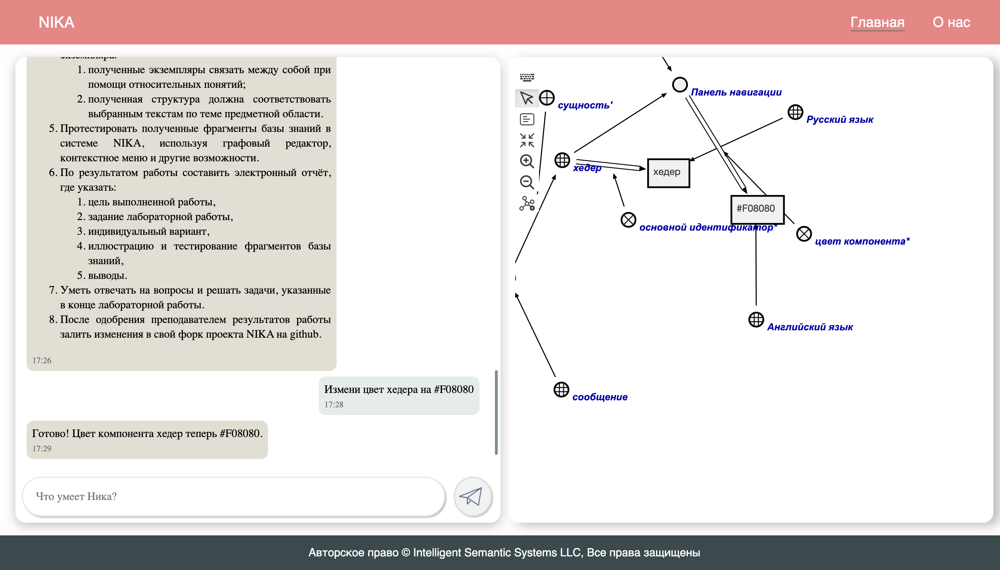

<p align="center"> Министерство образования Республики Беларусь</p>
<p align="center">Учреждение образования</p>
<p align="center">“Брестский Государственный технический университет”</p>
<p align="center">Кафедра ИИТ</p>
<br><br><br><br><br><br><br>
<p align="center">Лабораторная работа №4</p>
<p align="center">По дисциплине “Общая теория интеллектуальных систем”</p>
<p align="center">Тема: “Работа с проектом "NIKA" (Intelligent Knowledge-driven Assistant)”</p>
<br><br><br><br><br>
<p align="right">Выполнил:</p>
<p align="right">Студент 2 курса</p>
<p align="right">Группы ИИ-25</p>
<p align="right">Подгайский Д. А.</p>
<p align="right">Проверила:</p>
<p align="right">Ситковец Я. С.</p>
<br><br><br><br><br>
<p align="center">Брест 2024</p>

---

# Общее задание #
1. Изучить руководство.

2. Запустить данный проект на локальной машине (домашний персональный компьютер, ноутбук, рабочая машина в аудитории и т.п.). Продемонстрировать работу проекта преподавателю.

3. Написать отчет по выполненной работе в .md формате (readme.md) и с помощью pull request разместить его в следующем каталоге: trunk\ii0xxyy\task_04\doc.


---

# Выполнение #

Установил Docker, после чего по руководству установил проект NIKA, после этого я запустил его и приобрел некоторый опыт работы с этим проектом. Вот некоторые скриншоты, сделанные в процессе работы с этим проектом.

Installation:
```
git clone -c core.longpaths=true -c core.autocrlf=true https://github.com/ostis-apps/nika
cd nika
git submodule update --init --recursive
docker compose pull
```
Запуск:
```
docker compose up --no-build
```
Эта команда запуcкает 2 веб-интерфейса:

sc-web: ```localhost:8000```

Веб-диалог пользовательского интерфейса: ```localhost:3033```

sc-web:





Web-диалог пользовательского интерфейса: 



