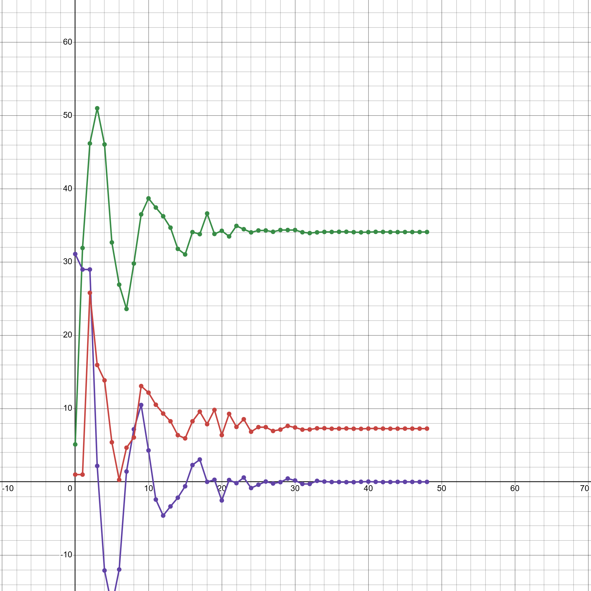

<p align="center"> Министерство образования Республики Беларусь</p>
<p align="center">Учреждение образования</p>
<p align="center">“Брестский Государственный технический университет”</p>
<p align="center">Кафедра ИИТ</p>
<br><br><br><br><br><br><br>
<p align="center">Лабораторная работа №2</p>
<p align="center">По дисциплине “Общая теория интеллектуальных систем”</p>
<p align="center">Тема: “ПИД-регуляторы”</p>
<br><br><br><br><br>
<p align="right">Выполнил:</p>
<p align="right">Студентка 2 курса</p>
<p align="right">Группы ИИ-25</p>
<p align="right">Мархель А. Д.</p>
<p align="right">Проверил:</p>
<p align="right">Иванюк Д. С.</p>
<br><br><br><br><br>
<p align="center">Брест 2024</p>

<hr>

# Общее задание #
1. Написать отчет по выполненной лабораторной работе №1 в .md формате (readme.md) и с помощью запроса на внесение изменений (pull request) разместить его в следующем каталоге: trunk\ii0xxyy\task_02\doc (где xx - номер группы, yy - номер студента, например ii02302)..
2. Исходный код написанной программы разместить в каталоге: **trunk\ii0xxyy\task_01\src**.
## Задание ##
Задание. На C++ реализовать программу, моделирующую рассмотренный выше ПИД-регулятор. В качестве объекта управления использовать математическую модель, полученную в предыдущей работе. В отчете также привести графики для разных заданий температуры объекта, пояснить полученные результаты.

<hr>

# Выполнение задания #

Код программы:
 
```#include <iostream>
#include <vector>
#include <cmath>
#include <iomanip>

const double A = 0.5;
const double B = 0.6;
const double C = 0.6;
const double D = 0.6;
const double K = 0.8;
const double T0 = 1.1;
const double TD = 1.0;
const double T = 1.1;
const double TARGET_VALUE = 20.0;

// Предвычисленные коэффициенты
const double q0 = K * (1 + (TD / T0));
const double q1 = -K * (1 + 2 * (TD / T0) - (T0 / T));
const double q2 = K * (TD / T0);

void simulateNonlinearModel() {
    const double initialY = 2.0;
    std::vector<double> outputs = { initialY, initialY }; // Вектор для хранения значений переменной y
    double controlSignal = 1.0; // Начальное значение управляющей переменной u
    std::vector<double> errors = { TARGET_VALUE - initialY, TARGET_VALUE - initialY }; // Вектор для хранения значений разности TARGET_VALUE - y
    std::vector<double> controlSignals = { controlSignal, controlSignal }; // Вектор для хранения значений предыдущей управляющей переменной u


    // Вывод результатов моделирования
    for (std::size_t i = 0; i < outputs.size(); i++) {
        std::cout << i + 1 << ") y[" << i << "] = " << outputs[i] << std::setw(15);
        std::cout << "e[" << i << "] = " << errors[i] << std::setw(15);
        std::cout << "u_pr[" << i << "] = " << controlSignals[i] << std::endl; // Вывод значений y, e и u_pr на каждой итерации цикла
    }

```    

