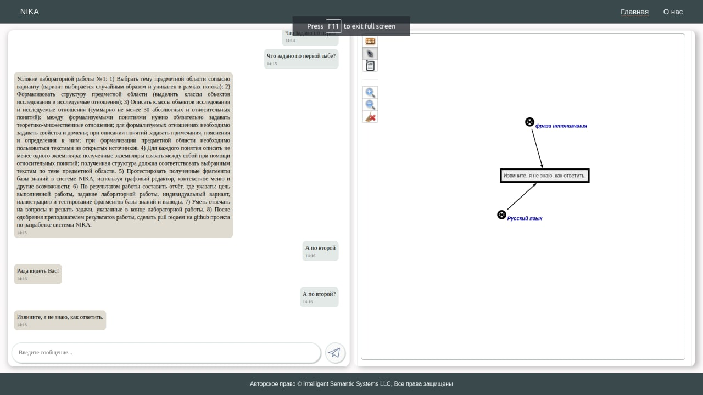

---

# Общее задание 
1.  Изучить руководство.

2.  Запустить данный проект на локальной машине (домашний персональный компьютер, ноутбук, рабочая машина в аудитории и т.п.). Продемонстрировать работу проекта преподавателю.

3.  Написать отчет по выполненной работе в .md формате (readme.md) и с помощью pull request разместить его в следующем каталоге: trunk\ii0xxyy\task_04\doc.

# Установка 

# Запуск
```
docker compose up --no-build
```
Эта команда запуcкает 2 веб-интерфейса:

  ```localhost:8000```

  ```localhost:3033```
  
# Работа



# Проект **NIKA** (Intelligent Knowledge-driven Assistant)

## Описание проекта

**NIKA** (Intelligent Knowledge-driven Assistant) — это интеллектуальный ассистент, разработанный для поддержки пользователей в управлении знаниями, анализе данных и автоматизации задач. Проект объединяет технологии обработки естественного языка (NLP), машинного обучения и знаний домена, чтобы предоставлять рекомендации, отвечать на вопросы и помогать принимать решения на основе доступной информации.

---

## Основные функции

### Управление знаниями
- **Сбор и организация данных**:
  - Интеграция с различными источниками данных (API, базы данных, документы).
  - Создание структурированных моделей знаний.
- **Поддержка онтологий и семантических графов**:
  - Построение и анализ связей между объектами знаний.
  - Визуализация графов знаний.

### Интеллектуальные функции
- **Обработка естественного языка (NLP)**:
  - Распознавание текста и генерация ответов.
  - Поддержка запросов на естественном языке.
- **Рекомендательные системы**:
  - Персонализированные советы на основе предпочтений и поведения пользователя.
- **Анализ данных**:
  - Прогнозирование и выявление паттернов.
  - Генерация отчетов и визуализаций.

### Автоматизация задач
- **Интеграция с внешними сервисами**:
  - Выполнение автоматических действий (например, отправка писем, обновление данных).
- **Напоминания и уведомления**:
  - Управление задачами и контроль сроков.
- **Моделирование сценариев**:
  - Анализ и прогнозирование событий на основе заданных условий.

---

## Архитектура проекта

### Компоненты системы:
1. **Ядро ассистента**:
   - Управляет обработкой запросов пользователя.
   - Обрабатывает данные и взаимодействует с базой знаний.
2. **База знаний**:
   - Хранение структурированных данных, онтологий и графов.
3. **Модули NLP**:
   - Распознавание текста и извлечение информации.
   - Генерация ответов на естественном языке.
4. **Модуль анализа данных**:
   - Выполнение статистических операций, машинного обучения и прогнозирования.
5. **Интеграционный модуль**:
   - Связь с внешними системами через API и подключаемые плагины.

---

## Технологический стек

- **Язык программирования**: Python, C++ (при необходимости для высокопроизводительных задач).
- **Библиотеки и фреймворки**:
  - NLP: Hugging Face Transformers, spaCy.
  - Машинное обучение: TensorFlow, PyTorch, Scikit-learn.
  - Графы знаний: Neo4j, NetworkX.
  - Web/API: FastAPI, Flask.
- **Инфраструктура**:
  - База данных: PostgreSQL, MongoDB.
  - Визуализация: D3.js, Plotly.

---

## Примеры использования

1. **Интеллектуальный помощник для бизнеса**:
   - Автоматизация создания отчетов.
   - Генерация рекомендаций по оптимизации процессов.
2. **Образовательный ассистент**:
   - Ответы на вопросы студентов.
   - Создание учебных планов.
3. **Анализ больших данных**:
   - Обработка данных из разных источников.
   - Выявление ключевых инсайтов.

---

## Как начать работу

### Установка
1. Клонируйте репозиторий:
   ```bash
   git clone https://github.com/your-repo/nika.git
