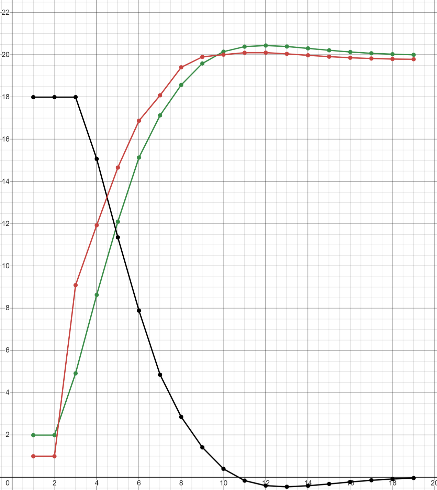

<p align="center"> Министерство образования Республики Беларусь</p>
<p align="center">Учреждение образования</p>
<p align="center">“Брестский Государственный технический университет”</p>
<p align="center">Кафедра ИИТ</p>
<br><br><br><br><br><br><br>
<p align="center">Лабораторная работа №2</p>
<p align="center">По дисциплине “Общая теория интеллектуальных систем”</p>
<p align="center">Тема: “ПИД-регуляторы”</p>
<br><br><br><br><br>
<p align="right">Выполнил:</p>
<p align="right">Студент 2 курса</p>
<p align="right">Группы ИИ-26</p>
<p align="right">Данилюк Т.В.</p>
<p align="right">Проверил:</p>
<p align="right">Ситковец Я. С.</p>
<br><br><br><br><br>
<p align="center">Брест 2024</p>

<hr>

# Общее задание #
1. Написать отчет по выполненной лабораторной работе №1 в .md формате (readme.md) и с помощью запроса на внесение изменений (**pull request**) разместить его в следующем каталоге: **trunk\ii0xxyy\task_02\doc** (где **xx** - номер группы, **yy** - номер студента, например **ii02302**).
2. Исходный код написанной программы разместить в каталоге: **trunk\ii0xxyy\task_02\src**.

# Задание #
Задание. На C++ реализовать программу, моделирующую рассмотренный выше ПИД-регулятор. В качестве объекта управления использовать математическую модель, полученную в предыдущей работе. В отчете также привести графики для разных заданий температуры объекта, пояснить полученные результаты.


<hr>

# Выполнение задания #

Код программы:
```C++
#include <iostream>
#include <vector>
#include <cmath>
using namespace std;

// Коэффициенты системы
double coeff_a, coeff_b, coeff_c, coeff_d;
// Параметры системы
double gain, time_const_0, time_delay, time_const, desired_output;
// Параметры регулятора
double reg_0, reg_1, reg_2;

void nonlinear_system() {
 // Начальные параметры
 const short int initial_output = 2;
 vector<double> output = { initial_output, initial_output };  // Выходные значения
 double control_signal = 1.0;  // Управляющий сигнал
 vector<double> error = { desired_output - initial_output, desired_output - initial_output };  // Ошибка
 vector<double> previous_control_signal = {control_signal, control_signal};  // Предыдущие значения управляющего сигнала

 // Цикл, пока ошибка не станет меньше заданного порога
 while (abs(desired_output - output.back()) > 0.01)
 {
  error.push_back(desired_output - output.back());  // Обновление ошибки
  control_signal = previous_control_signal.back() + reg_0 * error.back() + reg_1 * error[error.size() - 2] + reg_2 * error[error.size() - 3];
  // Рассчитываем новое значение выхода системы
  output.push_back(coeff_a * output.back() - coeff_b * output[output.size() - 2] + coeff_c * control_signal + coeff_d * sin(previous_control_signal.back()));
  previous_control_signal.push_back(control_signal);  // Сохраняем управляющий сигнал
 }

 // Вывод результатов
 cout << "Step\tOutput\tError\tControl Signal\n";
 for (int i = 0; i < output.size(); i++)
  cout << i + 1 << ";" << output[i] << ";" << error[i] << ";" << previous_control_signal[i] << endl;
}

int main() {
 // Ввод параметров системы
 setlocale(LC_ALL, "RU");
 cout << "Введите коэффициенты системы:\n";
 cout << "coeff_a: "; cin >> coeff_a;
 cout << "coeff_b: "; cin >> coeff_b;
 cout << "coeff_c: "; cin >> coeff_c;
 cout << "coeff_d: "; cin >> coeff_d;

 // Ввод параметров системы
 cout << "Введите параметры системы:\n";
 cout << "gain: "; cin >> gain;
 cout << "time_const_0: "; cin >> time_const_0;
 cout << "time_delay: "; cin >> time_delay;
 cout << "time_const: "; cin >> time_const;
 cout << "desired_output (желаемое значение выхода): "; cin >> desired_output;

 // Расчет параметров регулятора
 reg_0 = gain * (1 + (time_delay / time_const_0));
 reg_1 = -gain * (1 + 2 * (time_delay / time_const_0) - (time_const_0 / time_const));
 reg_2 = gain * (time_delay / time_const_0);

 // Запуск моделирования
 nonlinear_system();

 return 0;
}
'''
Вывод:
'''
  Введите коэффициенты системы:
coeff_a: 5
coeff_b: 2
coeff_c: 7
coeff_d: 2
Введите параметры системы:
gain: 8
time_const_0: 5
time_delay: 3
time_const: 7
desired_output (желаемое значение выхода): 4
Step    Output  Error   Control Signal
1;2;2;1
2;2;2;1
3;94.6829;2;12.4286
4;-7668.25;-90.6829;-1162.48
5;648378;7672.25;98129.8
6;-5.47915e+07;-648374;-8.29268e+06
7;4.63022e+09;5.47915e+07;7.00782e+08
8;-3.91282e+11;-4.63022e+09;-5.92204e+10
9;3.30657e+13;3.91282e+11;5.00449e+12
10;-2.79426e+15;-3.30657e+13;-4.2291e+14
11;2.36132e+17;2.79426e+15;3.57385e+16
12;-1.99546e+19;-2.36132e+17;-3.02012e+18
13;1.68629e+21;1.99546e+19;2.55219e+20
14;-1.42501e+23;-1.68629e+21;-2.15675e+22
15;1.20422e+25;1.42501e+23;1.82259e+24
16;-1.01764e+27;-1.20422e+25;-1.5402e+26
17;8.59971e+28;1.01764e+27;1.30156e+28
18;-7.26729e+30;-8.59971e+28;-1.0999e+30
19;6.1413e+32;7.26729e+30;9.29484e+31
20;-5.18978e+34;-6.1413e+32;-7.85471e+33
21;4.38568e+36;5.18978e+34;6.63771e+35
22;-3.70617e+38;-4.38568e+36;-5.60927e+37
23;3.13194e+40;3.70617e+38;4.74018e+39
24;-2.64668e+42;-3.13194e+40;-4.00574e+41
25;2.23661e+44;2.64668e+42;3.3851e+43
26;-1.89007e+46;-2.23661e+44;-2.86062e+45
27;1.59723e+48;1.89007e+46;2.4174e+47
28;-1.34975e+50;-1.59723e+48;-2.04285e+49
29;1.14062e+52;1.34975e+50;1.72633e+51
30;-9.63898e+53;-1.14062e+52;-1.45886e+53
31;8.14553e+55;9.63898e+53;1.23282e+55
32;-6.88347e+57;-8.14553e+55;-1.04181e+57
33;5.81696e+59;6.88347e+57;8.80394e+58
34;-4.91568e+61;-5.81696e+59;-7.43987e+60
35;4.15406e+63;4.91568e+61;6.28715e+62
36;-3.51043e+65;-4.15406e+63;-5.31302e+64
37;2.96653e+67;3.51043e+65;4.48983e+66
38;-2.5069e+69;-2.96653e+67;-3.79418e+68
39;2.11848e+71;2.5069e+69;3.20632e+70
40;-1.79025e+73;-2.11848e+71;-2.70954e+72
41;1.51287e+75;1.79025e+73;2.28972e+74
42;-1.27847e+77;-1.51287e+75;-1.93496e+76
43;1.08038e+79;1.27847e+77;1.63516e+78
44;-9.12991e+80;-1.08038e+79;-1.38181e+80
45;7.71533e+82;9.12991e+80;1.16771e+82
46;-6.51993e+84;-7.71533e+82;-9.86789e+83
47;5.50974e+86;6.51993e+84;8.33897e+85
48;-4.65607e+88;-5.50974e+86;-7.04694e+87
49;3.93466e+90;4.65607e+88;5.9551e+89
50;-3.32503e+92;-3.93466e+90;-5.03242e+91
51;2.80986e+94;3.32503e+92;4.25271e+93
52;-2.3745e+96;-2.80986e+94;-3.5938e+95
53;2.0066e+98;2.3745e+96;3.03698e+97
54;-1.6957e+100;-2.0066e+98;-2.56643e+99
55;1.43297e+102;1.6957e+100;2.16879e+101
56;-1.21095e+104;-1.43297e+102;-1.83276e+103
57;1.02332e+106;1.21095e+104;1.5488e+105
58;-8.64772e+107;-1.02332e+106;-1.30883e+107
59;7.30786e+109;8.64772e+107;1.10604e+109
60;-6.17559e+111;-7.30786e+109;-9.34673e+110
61;5.21875e+113;6.17559e+111;7.89856e+112
62;-4.41016e+115;-5.21875e+113;-6.67477e+114
63;3.72686e+117;4.41016e+115;5.64059e+116
64;-3.14942e+119;-3.72686e+117;-4.76664e+118
65;2.66146e+121;3.14942e+119;4.0281e+120
66;-2.24909e+123;-2.66146e+121;-3.404e+122
67;1.90062e+125;2.24909e+123;2.87658e+124
68;-1.60614e+127;-1.90062e+125;-2.43089e+126
69;1.35729e+129;1.60614e+127;2.05425e+128
70;-1.14699e+131;-1.35729e+129;-1.73597e+130
71;9.69279e+132;1.14699e+131;1.467e+132
72;-8.191e+134;-9.69279e+132;-1.23971e+134
73;6.9219e+136;8.191e+134;1.04763e+136
74;-5.84943e+138;-6.9219e+136;-8.85309e+137
75;4.94313e+140;5.84943e+138;7.4814e+139
76;-4.17725e+142;-4.94313e+140;-6.32225e+141
77;3.53003e+144;4.17725e+142;5.34268e+143
78;-2.98309e+146;-3.53003e+144;-4.5149e+145
79;2.52089e+148;2.98309e+146;3.81536e+147
80;-2.13031e+150;-2.52089e+148;-3.22422e+149
81;1.80024e+152;2.13031e+150;2.72466e+151
82;-1.52132e+154;-1.80024e+152;-2.30251e+153
83;1.28561e+156;1.52132e+154;1.94576e+155
84;-1.08642e+158;-1.28561e+156;-1.64429e+157
85;9.18088e+159;1.08642e+158;1.38952e+159
86;-7.7584e+161;-9.18088e+159;-1.17423e+161
87;6.55633e+163;7.7584e+161;9.92298e+162
88;-5.5405e+165;-6.55633e+163;-8.38552e+164
89;4.68206e+167;5.5405e+165;7.08628e+166
90;-3.95663e+169;-4.68206e+167;-5.98834e+168
91;3.34359e+171;3.95663e+169;5.06052e+170
92;-2.82554e+173;-3.34359e+171;-4.27645e+172
93;2.38776e+175;2.82554e+173;3.61386e+174
94;-2.0178e+177;-2.38776e+175;-3.05393e+176
95;1.70517e+179;2.0178e+177;2.58076e+178
96;-1.44097e+181;-1.70517e+179;-2.1809e+180
97;1.21771e+183;1.44097e+181;1.843e+182
98;-1.02904e+185;-1.21771e+183;-1.55744e+184
99;8.696e+186;1.02904e+185;1.31614e+186
100;-7.34865e+188;-8.696e+186;-1.11222e+188
101;6.21006e+190;7.34865e+188;9.39891e+189
102;-5.24788e+192;-6.21006e+190;-7.94265e+191
103;4.43478e+194;5.24788e+192;6.71203e+193
104;-3.74766e+196;-4.43478e+194;-5.67208e+195
105;3.16701e+198;3.74766e+196;4.79325e+197
106;-2.67631e+200;-3.16701e+198;-4.05059e+199
107;2.26165e+202;2.67631e+200;3.423e+201
108;-1.91123e+204;-2.26165e+202;-2.89264e+203
109;1.61511e+206;1.91123e+204;2.44446e+205
110;-1.36487e+208;-1.61511e+206;-2.06572e+207
111;1.1534e+210;1.36487e+208;1.74566e+209
112;-9.7469e+211;-1.1534e+210;-1.47519e+211
113;8.23673e+213;9.7469e+211;1.24663e+213
114;-6.96054e+215;-8.23673e+213;-1.05348e+215
115;5.88208e+217;6.96054e+215;8.90251e+216
116;-4.97072e+219;-5.88208e+217;-7.52317e+218
117;4.20057e+221;4.97072e+219;6.35754e+220
118;-3.54974e+223;-4.20057e+221;-5.37251e+222
119;2.99974e+225;3.54974e+223;4.5401e+224
120;-2.53497e+227;-2.99974e+225;-3.83666e+226
121;2.1422e+229;2.53497e+227;3.24222e+228
122;-1.81029e+231;-2.1422e+229;-2.73987e+230
123;1.52981e+233;1.81029e+231;2.31536e+232
124;-1.29278e+235;-1.52981e+233;-1.95662e+234
125;1.09248e+237;1.29278e+235;1.65346e+236
126;-9.23213e+238;-1.09248e+237;-1.39728e+238
127;7.80172e+240;9.23213e+238;1.18079e+240
128;-6.59293e+242;-7.80172e+240;-9.97837e+241
129;5.57143e+244;6.59293e+242;8.43234e+243
130;-4.7082e+246;-5.57143e+244;-7.12584e+245
131;3.97872e+248;4.7082e+246;6.02177e+247
132;-3.36226e+250;-3.97872e+248;-5.08877e+249
133;2.84132e+252;3.36226e+250;4.30032e+251
134;-2.40109e+254;-2.84132e+252;-3.63403e+253
135;2.02907e+256;2.40109e+254;3.07098e+255
136;-1.71468e+258;-2.02907e+256;-2.59517e+257
137;1.44901e+260;1.71468e+258;2.19308e+259
138;-1.22451e+262;-1.44901e+260;-1.85328e+261
139;1.03478e+264;1.22451e+262;1.56614e+263
140;-8.74454e+265;-1.03478e+264;-1.32348e+265
141;7.38968e+267;8.74454e+265;1.11842e+267
142;-6.24473e+269;-7.38968e+267;-9.45137e+268
143;5.27718e+271;6.24473e+269;7.98699e+270
144;-4.45954e+273;-5.27718e+271;-6.7495e+272
145;3.76859e+275;4.45954e+273;5.70374e+274
146;-3.18469e+277;-3.76859e+275;-4.82001e+276
147;2.69125e+279;3.18469e+277;4.0732e+278
148;-2.27428e+281;-2.69125e+279;-3.44211e+280
149;1.9219e+283;2.27428e+281;2.90879e+282
150;-1.62413e+285;-1.9219e+283;-2.45811e+284
151;1.37249e+287;1.62413e+285;2.07725e+286
152;-1.15983e+289;-1.37249e+287;-1.75541e+288
153;9.80131e+290;1.15983e+289;1.48343e+290
154;-8.28271e+292;-9.80131e+290;-1.25359e+292
155;6.9994e+294;8.28271e+292;1.05936e+294
156;-5.91492e+296;-6.9994e+294;-8.95221e+295
157;4.99847e+298;5.91492e+296;7.56517e+297
158;-4.22401e+300;-4.99847e+298;-6.39303e+299
159;3.56955e+302;4.22401e+300;5.4025e+301
160;-3.01649e+304;-3.56955e+302;-4.56545e+303
161;2.54912e+306;3.01649e+304;3.85808e+305
162;-inf;-2.54912e+306;-3.26032e+307
163;-nan(ind);inf;inf
'''
