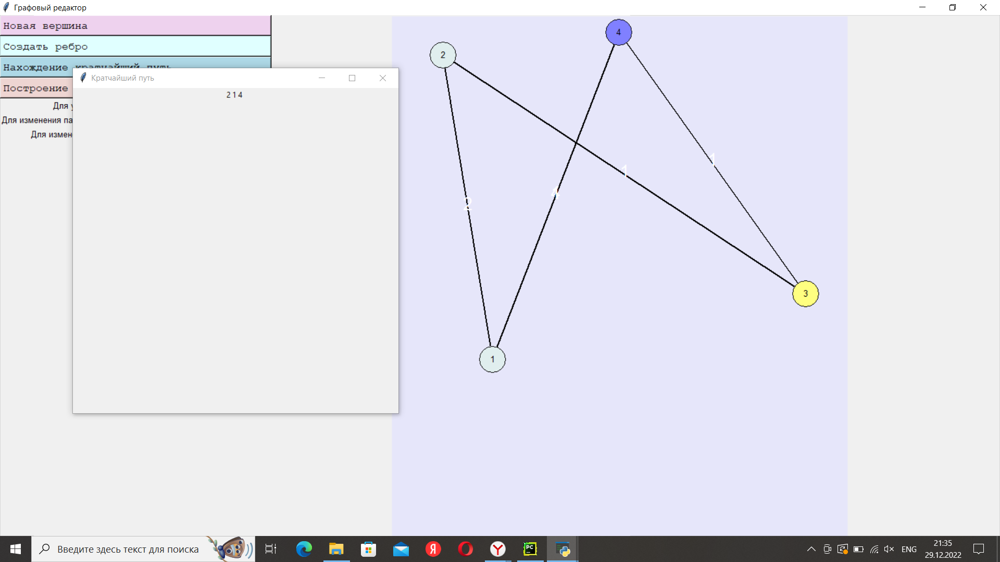
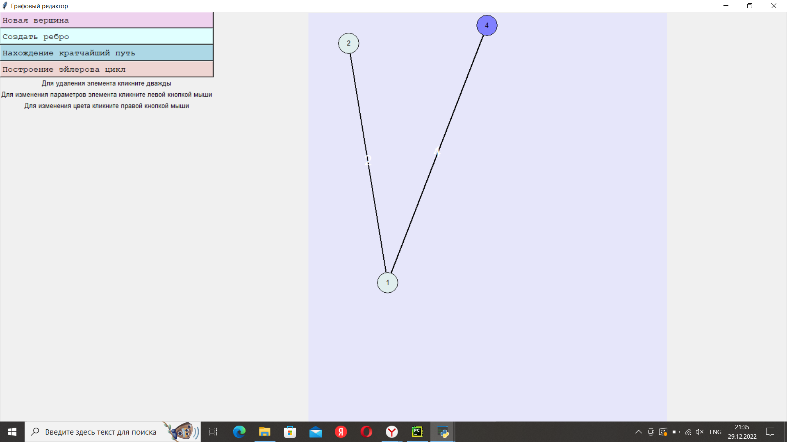

Министерство образования Республики Беларусь

Учреждение образования

«Брестский государственный технический университет»

Кафедра ИИТ

     

Лабораторная работа №3

За третий семестр

По дисциплине: «Общая теория интеллектуальных систем»

Тема: «Разработка редакторов графов»

     

Выполнил:

Студент 2 курса

Группы ИИ-26

Згера Е.А.

  

Проверил:

Иванюк Д.С.

Брест 2024  

--
# В работе было реализованно: #
Разработка и создание программного обеспечения, которое предоставляет возможности для редактирования графов различных типов и выполнения операций с ними.

Функциональные возможности редактора: a) поддержка одновременной работы с несколькими графами (MDI);
b) [*] возможность выделения нескольких элементов графа одновременно, копирования выделенного фрагмента в буфер обмена и его восстановления;
c) возможность присваивать имена графам;
d) функция сохранения и восстановления графа в внутреннем формате приложения;
e) поддержка экспорта и импорта графа в текстовый формат (описание указано ниже);
f) возможность создания, удаления, переименования, перемещения узлов;
g) создание неориентированных дуг и их удаление;
h) добавление, удаление и редактирование содержимого узлов (содержимое может быть текстом или ссылкой на файл);
i) возможность изменения цвета дуг и узлов, а также их визуального представления;
j) [*] возможность создания и отображения петель;
k) [*] создание и отображение кратных дуг.

Основные операции, доступные в программном продукте: a) вывод информации о графе;
b) поиск всех путей (маршрутов) между двумя узлами, включая кратчайшие;
c) вычисление расстояния между двумя узлами;
d) [*] раскраска графа;
e) нахождение эйлеровых циклов.

Отчет о выполненной лабораторной работе должен быть оформлен в формате .md (readme.md). Он должен быть размещен в следующем каталоге: trunk\ii0xxyy\task_03\doc (где xx — номер группы, а yy — номер студента, например ii02302).

