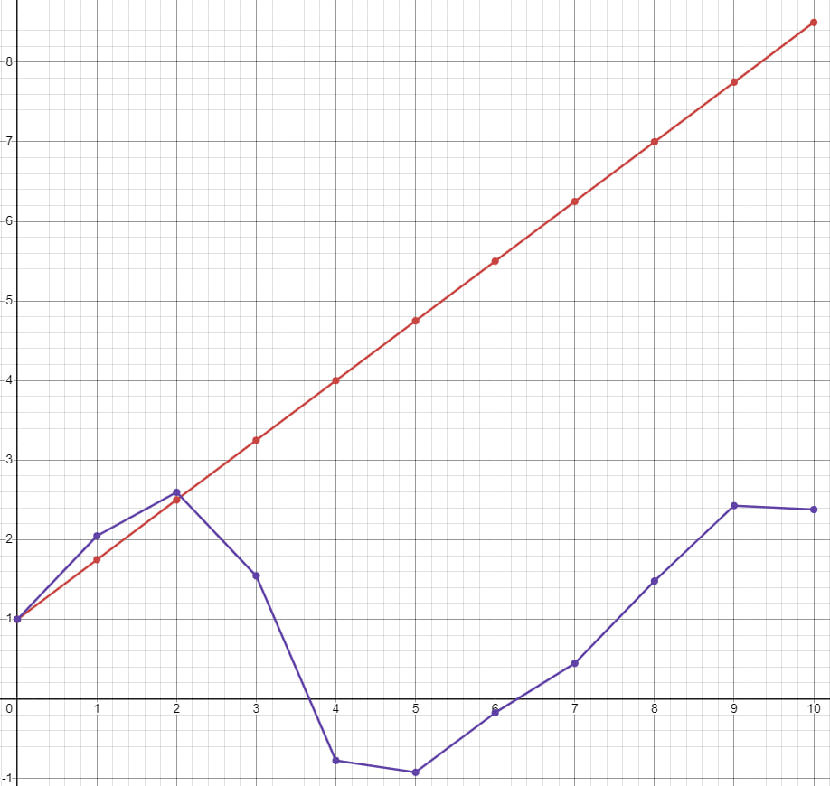

<p align="center"> Министерство образования Республики Беларусь</p>
<p align="center">Учреждение образования</p>
<p align="center">“Брестский Государственный технический университет”</p>
<p align="center">Кафедра ИИТ</p>
<br><br><br><br><br><br><br>
<p align="center">Лабораторная работа №1</p>
<p align="center">По дисциплине “Общая теория интеллектуальных систем”</p>
<p align="center">Тема: “Моделирования температуры объекта”</p>
<br><br><br><br><br>
<p align="right">Выполнила:</p>
<p align="right">Студентка 2 курса</p>
<p align="right">Группы ИИ-26</p>
<p align="right">Карпович К. А.</p>
<p align="right">Проверила:</p>
<p align="right">Ситковец Я. С.</p>
<br><br><br><br><br>
<p align="center">Брест 2024</p>

<hr>

# Общее задание #
1. Написать отчет по выполненной лабораторной работе №1 в .md формате (readme.md) и с помощью запроса на внесение изменений (**pull request**) разместить его в следующем каталоге: **trunk\ii0xxyy\task_01\doc** (где **xx** - номер группы, **yy** - номер студента, например **ii02102**).
2. Исходный код написанной программы разместить в каталоге: **trunk\ii0xxyy\task_01\src**.
## Task 1. Modeling controlled object ##
Let's get some object to be controlled. We want to control its temperature, which can be described by this differential equation:

$$\Large\frac{dy(\tau)}{d\tau}=\frac{u(\tau)}{C}+\frac{Y_0-y(\tau)}{RC} $$ (1)

where $\tau$ – time; $y(\tau)$ – input temperature; $u(\tau)$ – input warm; $Y_0$ – room temperature; $C,RC$ – some constants.

After transformation, we get these linear (2) and nonlinear (3) models:

$$\Large y_{\tau+1}=ay_{\tau}+bu_{\tau}$$ (2)
$$\Large y_{\tau+1}=ay_{\tau}-by_{\tau-1}^2+cu_{\tau}+d\sin(u_{\tau-1})$$ (3)

where $\tau$ – time discrete moments ($1,2,3{\dots}n$); $a,b,c,d$ – some constants.

Task is to write program (**С++**), which simulates this object temperature.

<hr>

# Выполнение задания #

Код программы:
```C++
#include <iostream>
#include <vector>
#include <cmath>

using namespace std;

// Константы модели
const double a = 0.8;  // Примерное значение
const double b = 0.05; // Примерное значение
const double c = 0.1;  // Примерное значение
const double d = 0.02; // Примерное значение

// Функция для расчета rpex (предполагаем, что это функция активации)
double rpex(double u_prev) {
    return std::exp(-u_prev);
}

int main() {
    setlocale(LC_ALL, "RU");
    int n = 10; // Количество временных шагов
    double y_0 = 20.0; // Начальная температура
    double u = 5.0; // Постоянное входное тепло

    std::vector<double> y_linear(n + 1, y_0);
    std::vector<double> y_nonlinear(n + 1, y_0);

    // Моделирование линейной и нелинейной модели
    for (int tau = 0; tau < n; ++tau) {
        // Линейная модель
        y_linear[tau + 1] = a * y_linear[tau] + b * u;

        // Нелинейная модель
        double u_prev = (tau > 0) ? u : 0.0; // u_{τ-1}, для первого шага считаем его 0
        y_nonlinear[tau + 1] = a * y_nonlinear[tau] - b * std::pow(y_nonlinear[tau], 2) + c * u + d * rpex(u_prev);
    }

    // Вывод результатов
    std::cout << "Временной шаг\tЛинейная модель\tНелинейная модель\n";
    for (int tau = 0; tau <= n; ++tau) {
        std::cout << tau << "\t\t" << y_linear[tau] << "\t\t" << y_nonlinear[tau] << "\n";
    }

    return 0;
}
```     
```
Временной шаг   Линейная модель Нелинейная модель
0               20              20
1               16.25           -3.48
2               13.25           -2.88939
3               10.85           -2.2288
4               8.93            -1.53128
5               7.394           -0.842134
6               6.1652          -0.209031
7               5.18216         0.330725
8               4.39573         0.759246
9               3.76658         1.07871
10              3.26327         1.30492

