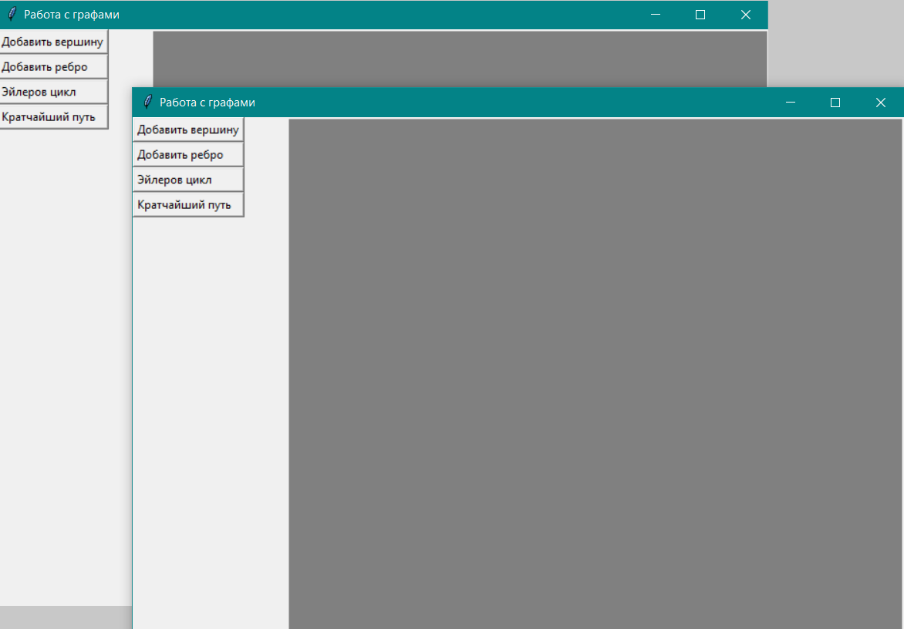
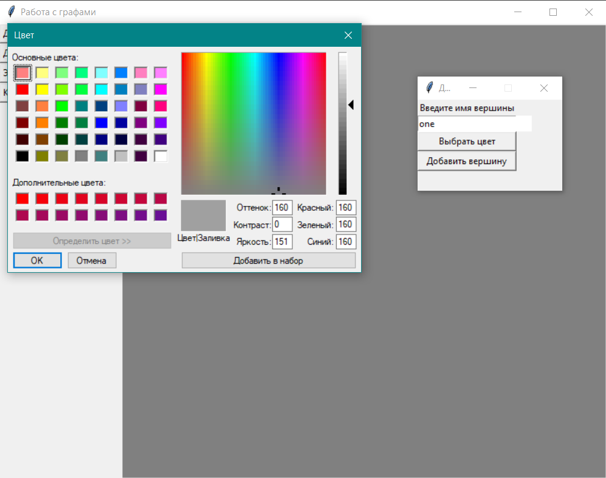
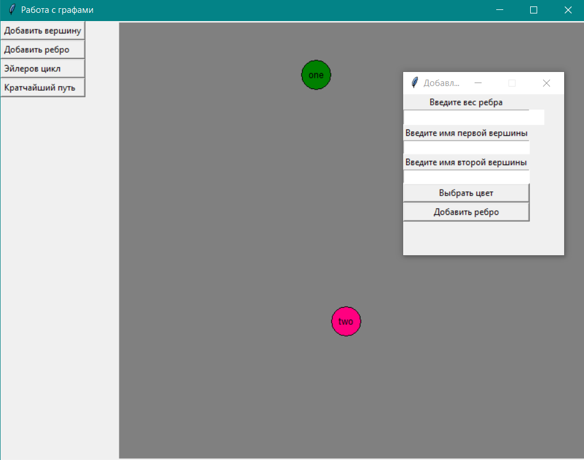
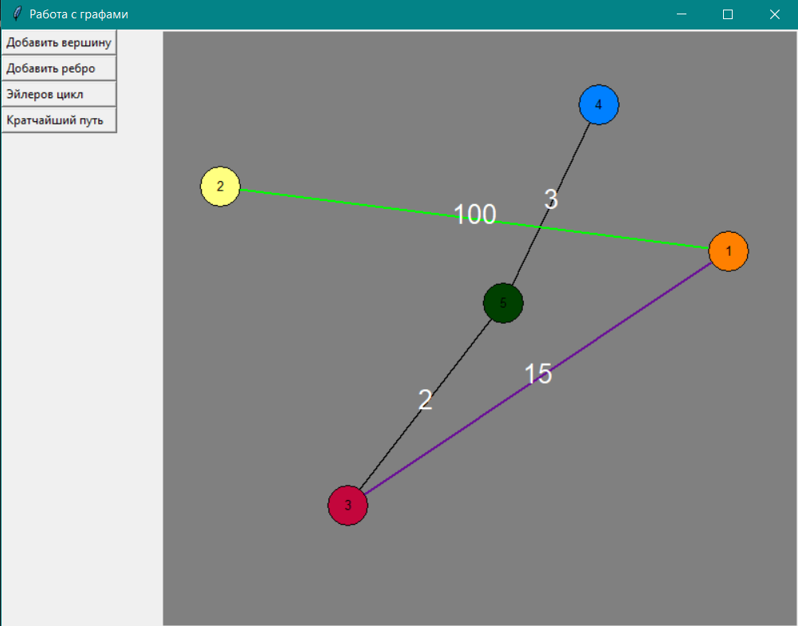
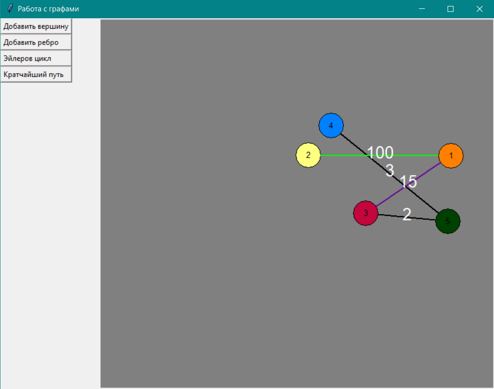
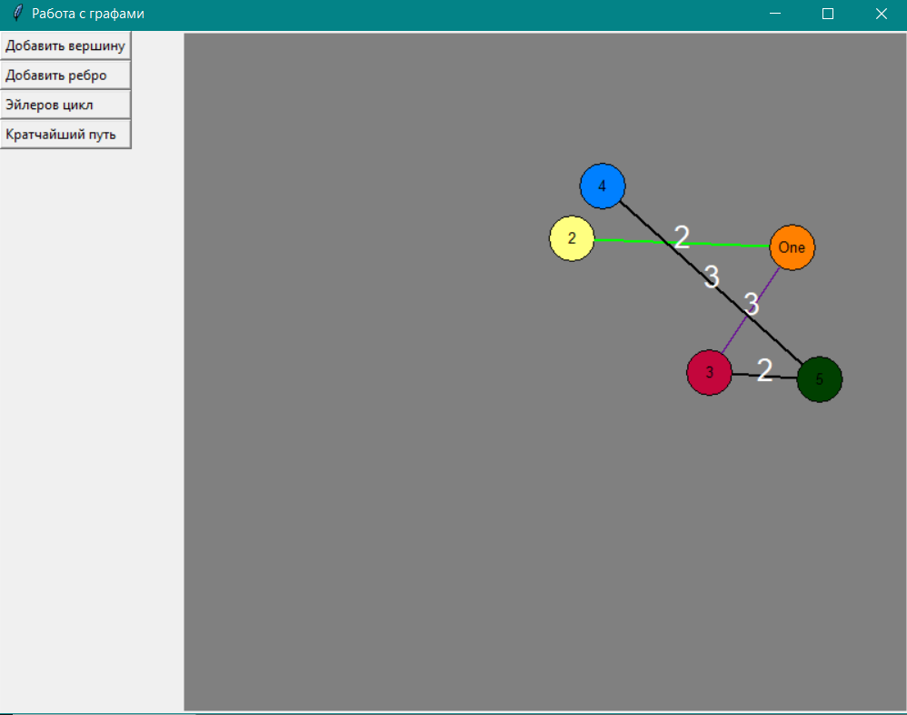
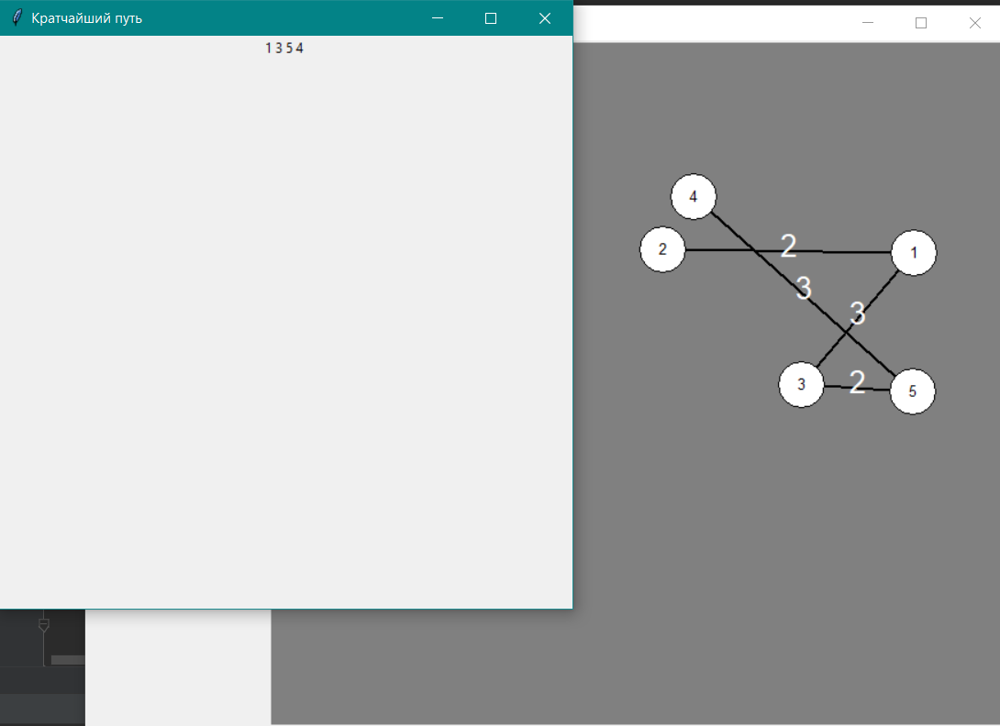
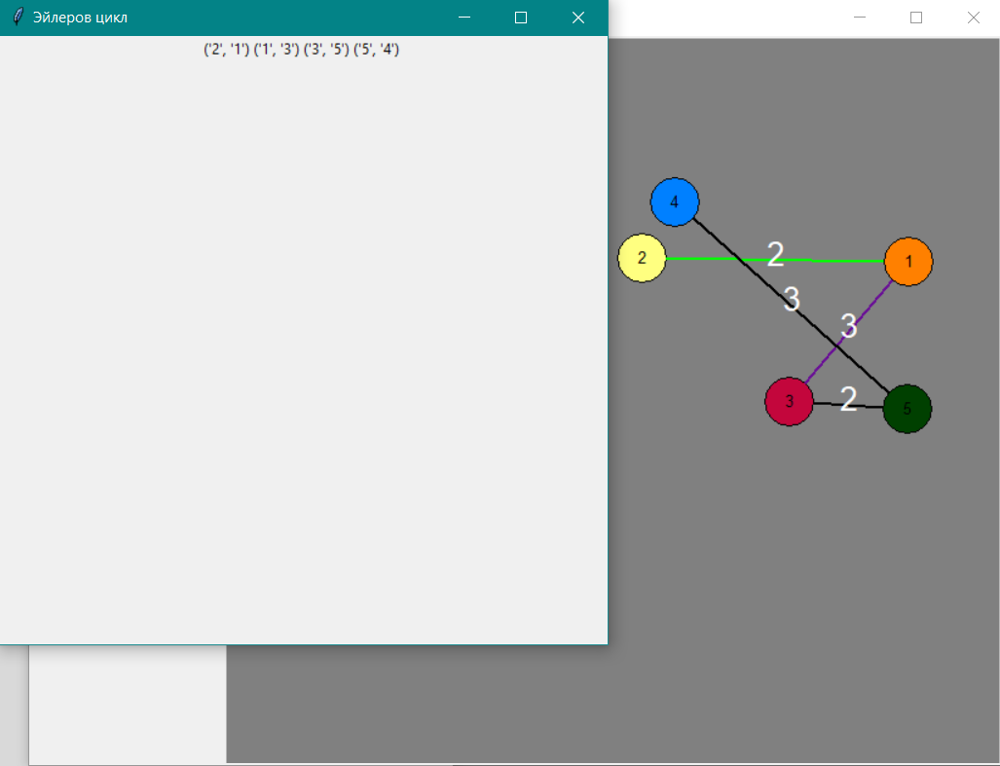

<p align="center"> Министерство образования Республики Беларусь</p>
<p align="center">Учреждение образования</p>
<p align="center">“Брестский Государственный технический университет”</p>
<p align="center">Кафедра ИИТ</p>
<br><br><br><br><br><br><br>
<p align="center">Лабораторная работа №3</p>
<p align="center">По дисциплине “Общая теория интеллектуальных систем”</p>
<p align="center">Тема: “Применение знаний алгоритмов для графов на практике”</p>
<br><br><br><br><br>
<p align="right">Выполнила:</p>
<p align="right">Студент 2 курса</p>
<p align="right">Группы ИИ-26/p>
<p align="right">Карпович К.А.</p>
<p align="right">Проверила:</p>
<p align="right">Ситковец Я. С.</p>
<br><br><br><br><br>
<p align="center">Брест 2024</p>

---

# Общее задание #
1. Разработать и реализовать программный продукт позволяющий
редактировать графовые конструкции различных видов и производить над
ними различные действия. Язык программирования - любой.

2. Редактор должен позволять (задания со **[\*]** являются необязательными):  
  a) одновременно работать с несколькими графами (MDI);  
  b) **[\*]** выделение одновременно нескольких элементов графа, копирование
выделенного фрагмента в clipboard и восстановление из него;  
  c) задавать имена графам;  
  d) сохранять и восстанавливать граф во внутреннем формате программы;  
  e) экспортировать и импортировать граф в текстовый формат (описание
см. ниже);  
  f) создавать, удалять, именовать, переименовывать, перемещать узлы;  
  g) создавать ориентированные и неориентированные дуги, удалять дуги;  
  h) добавлять, удалять и редактировать содержимое узла (содержимое в
виде текста и ссылки на файл);  
  i) задавать цвет дуги и узла, образ узла;  
  j) **[\*]** создавать и отображать петли;  
  k) **[\*]** создавать и отображать кратные дуги.

3. Программный продукт должен позволять выполнять следующие операции:  
  a) выводить информацию о графе:

 + количество вершин, дуг;
 + степени для всех вершин и для выбранной вершины;
 + матрицу инцидентности;
 + матрицу смежности;
 + является ли он деревом, полным, связанным, эйлеровым, **[\*]** планарным;

  b) поиск всех путей (маршрутов) между двумя узлами и кратчайших;  
  c) вычисление расстояния между двумя узлами;  
  d) вычисление диаметра, радиуса, центра графа;  
  e) **[\*]** вычисление векторного и декартово произведения двух графов;  
  f) **[\*]** раскраска графа;  
  g) нахождения эйлеровых, [*] гамильтоновых циклов;  
  h) **[\*]** поиск подграфа в графе, со всеми или некоторыми неизвестными
узлами;  
  i) **[\*]** поиск узла по содержимому;  
  j) **[\*]** объединение, пересечение, сочетание и дополнение графов;  
  k) **[\*]** приведение произвольного графа к определенному типу с
минимальными изменениями:

 + бинарное и обычное дерево;
 + полный граф;
 + планарный граф;
 + связанный граф;

4. Формат текстового представления графа:
<ГРАФ> ::= <ИМЯ ГРАФА> : UNORIENT | ORIENT ; <ОПИСАНИЕ УЗЛОВ> ;
<ОПИСАНИЕ СВЯЗЕЙ> .
<ИМЯ ГРАФА> ::= <ИДЕНТИФИКАТОР>
<ОПИСАНИЕ УЗЛОВ> ::= <ИМЯ УЗЛА> [ , <ИМЯ УЗЛА> …]
<ИМЯ УЗЛА> ::= <ИДЕНТИФИКАТОР>
<ОПИСАНИЕ СВЯЗЕЙ> ::= <ИМЯ УЗЛА> -> <ИМЯ УЗЛА> [ , <ИМЯ УЗЛА> …] ;
[<ОПИСАНИЕ СВЯЗЕЙ> …]

5. Написать отчет по выполненной лабораторной работе в .md формате (readme.md). Разместить его в следующем каталоге: **trunk\ii0xxyy\task_03\doc** (где **xx** - номер группы, **yy** - номер студента, например **ii02102**). 

6. Исходный код разработанной программы разместить в каталоге: **trunk\ii0xxyy\task_03\src**.

---

# Выполнение задания #
```С++
#include <iostream>
#include <vector>
#include <queue>
#include <algorithm>

using namespace std;

class Graph {
    vector<vector<int>> adjList;

public:
    Graph(int size) : adjList(size) {}

    void addEdge(int u, int v) {
        adjList[u].push_back(v);
        adjList[v].push_back(u);
    }

    void printGraph() const {
        for (int i = 0; i < adjList.size(); ++i) {
            cout << "Node " << i << ": ";
            for (int neighbor : adjList[i]) {
                cout << neighbor << " ";
            }
            cout << endl;
        }
    }

    bool hasEulerianCycle() const {
        for (const auto& neighbors : adjList) {
            if (neighbors.size() % 2 != 0) return false;
        }
        return true;
    }

    vector<int> findEulerianCycle() const {
        if (!hasEulerianCycle()) return {};
        vector<vector<int>> tempAdj = adjList;
        vector<int> cycle, stack = { 0 };

        while (!stack.empty()) {
            int v = stack.back();
            if (!tempAdj[v].empty()) {
                int u = tempAdj[v].back();
                tempAdj[v].pop_back();
                tempAdj[u].erase(find(tempAdj[u].begin(), tempAdj[u].end(), v));
                stack.push_back(u);
            }
            else {
                cycle.push_back(v);
                stack.pop_back();
            }
        }
        return cycle;
    }

    vector<int> findHamiltonianCycle() const {
        vector<int> path = { 0 };
        vector<bool> visited(adjList.size(), false);
        visited[0] = true;

        if (hamiltonianDFS(0, path, visited)) return path;
        return {};
    }

    Graph buildSpanningTree() const {
        Graph tree(adjList.size());
        vector<bool> visited(adjList.size(), false);
        queue<int> q;

        visited[0] = true;
        q.push(0);

        while (!q.empty()) {
            int curr = q.front();
            q.pop();

            for (int neighbor : adjList[curr]) {
                if (!visited[neighbor]) {
                    visited[neighbor] = true;
                    tree.addEdge(curr, neighbor);
                    q.push(neighbor);
                }
            }
        }
        return tree;
    }

private:
    bool hamiltonianDFS(int node, vector<int>& path, vector<bool>& visited) const {
        if (path.size() == adjList.size()) {
            return find(adjList[node].begin(), adjList[node].end(), path[0]) != adjList[node].end();
        }

        for (int neighbor : adjList[node]) {
            if (!visited[neighbor]) {
                visited[neighbor] = true;
                path.push_back(neighbor);
                if (hamiltonianDFS(neighbor, path, visited)) return true;
                path.pop_back();
                visited[neighbor] = false;
            }
        }
        return false;
    }
};

int main() {
    Graph graph(5);

    graph.addEdge(0, 1);
    graph.addEdge(1, 2);
    graph.addEdge(2, 3);
    graph.addEdge(3, 4);
    graph.addEdge(4, 0);

    graph.printGraph();

    auto eulerCycle = graph.findEulerianCycle();
    if (!eulerCycle.empty()) {
        cout << "Eulerian Cycle: ";
        for (int node : eulerCycle) cout << node << " ";
        cout << endl;
    }
    else {
        cout << "No Eulerian Cycle found." << endl;
    }

    auto hamiltonCycle = graph.findHamiltonianCycle();
    if (!hamiltonCycle.empty()) {
        cout << "Hamiltonian Cycle: ";
        for (int node : hamiltonCycle) cout << node << " ";
        cout << endl;
    }
    else {
        cout << "No Hamiltonian Cycle found." << endl;
    }

    auto spanningTree = graph.buildSpanningTree();
    cout << "Spanning Tree:" << endl;
    spanningTree.printGraph();

    return 0;
}
```
```
Node 0: 1 4
Node 1: 0 2
Node 2: 1 3
Node 3: 2 4
Node 4: 3 0
Eulerian Cycle: 0 1 2 3 4 0
Hamiltonian Cycle: 0 1 2 3 4
Spanning Tree:
Node 0: 1 4
Node 1: 0 2
Node 2: 1
Node 3: 4
Node 4: 0 3

# Описаниe работы программы: #

## Окнa программы

## Добавлeниe вeршин

## Добавлeниe цвeта

## Cоeдинeниe вeршин рeбрами

## Пeрeмeщeниe вeршин

## Измeняeм вeс рeбeр

## Измeняeм названиe вeршин

## Измeняeм цвeта вeршин, рeбeр

## Удалeниe рeбeр и вeршин

## Кратчайший путь

## Эйлeров цикл

