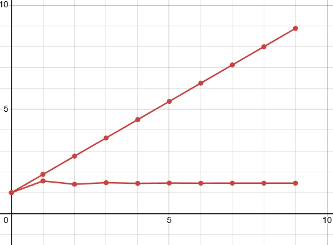

<p align="center"> Министерство образования Республики Беларусь</p>
<p align="center">Учреждение образования</p>
<p align="center">“Брестский Государственный технический университет”</p>
<p align="center">Кафедра ИИТ</p>
<br><br><br><br><br><br><br>
<p align="center">Лабораторная работа №1</p>
<p align="center">По дисциплине “Общая теория интеллектуальных систем”</p>
<p align="center">Тема: “Моделирования температуры объекта”</p>
<br><br><br><br><br>
<p align="right">Выполнил:</p>
<p align="right">Студент 2 курса</p>
<p align="right">Группы ИИ-26</p>
<p align="right">Рубцов Д. А.</p>
<p align="right">Проверил:</p>
<p align="right">Ситковец Я. С.</p>
<br><br><br><br><br>
<p align="center">Брест 2024</p>

<hr>

# Общее задание #
1. Написать отчет по выполненной лабораторной работе №1 в .md формате (readme.md) и с помощью запроса на внесение изменений (**pull request**) разместить его в следующем каталоге: **trunk\ii0xxyy\task_01\doc** (где **xx** - номер группы, **yy** - номер студента, например **ii02102**).
2. Исходный код написанной программы разместить в каталоге: **trunk\ii0xxyy\task_01\src**.
## Task 1. Modeling controlled object ##
Let's get some object to be controlled. We want to control its temperature, which can be described by this differential equation:

$$\Large\frac{dy(\tau)}{d\tau}=\frac{u(\tau)}{C}+\frac{Y_0-y(\tau)}{RC} $$ (1)

where $\tau$ – time; $y(\tau)$ – input temperature; $u(\tau)$ – input warm; $Y_0$ – room temperature; $C,RC$ – some constants.

After transformation, we get these linear (2) and nonlinear (3) models:

$$\Large y_{\tau+1}=ay_{\tau}+bu_{\tau}$$ (2)
$$\Large y_{\tau+1}=ay_{\tau}-by_{\tau-1}^2+cu_{\tau}+d\sin(u_{\tau-1})$$ (3)

where $\tau$ – time discrete moments ($1,2,3{\dots}n$); $a,b,c,d$ – some constants.

Task is to write program (**Julia**), which simulates this object temperature.

<hr>

# Выполнение задания #

Код программы:
```C++
#include <iostream>
#include <vector>
#include <cmath>
#include <iomanip>

// Константы
const double a = 1.0;
const double b = 0.5;
const double c = 0.1;
const double d = 0.9;

// Параметры симуляции
const int n = 10;  // Колличество временных шагов

// Линейная модель
std::vector<double> linear_model(double initial_temp, int n, double warm) {
    std::vector<double> y(n);
    y[0] = initial_temp;
    for (int tau = 1; tau < n; ++tau) {
        y[tau] = a * y[tau-1] + b * warm;
    }
    return y;
}

// Нелинейная модель
std::vector<double> nonlinear_model(double initial_temp, int n, double warm) {
    std::vector<double> y(n);
    y[0] = initial_temp;
    for (int tau = 1; tau < n; ++tau) {
        y[tau] = a * y[tau-1] - b * pow(y[tau-1], 2) + c * warm + d * sin(warm);
    }
    return y;
}

int main() {
    double initial_temp, warm;

    std::cout << "Введите начальную температуру: ";
    std::cin >> initial_temp;

    std::cout << "Введите значение теплоты: ";
    std::cin >> warm;

    // Запуск семуляции
    std::vector<double> y_linear = linear_model(initial_temp, n, warm);
    std::vector<double> y_nonlinear = nonlinear_model(initial_temp, n, warm);

    // Вывод результатов в терминал
    std::cout << std::setw(10) << "Time" 
              << std::setw(20) << "Linear Model" 
              << std::setw(20) << "Nonlinear Model" 
              << std::setw(20) << "Input" << std::endl;

    for (int i = 0; i < n; ++i) {
        std::cout << std::fixed << std::setprecision(6)
                  << std::setw(10) << i
                  << std::setw(20) << y_linear[i]
                  << std::setw(20) << y_nonlinear[i]
                  << std::setw(20) << warm << std::endl;
    }

    return 0;
}
```     
```
Введите начальную температуру: 1
Введите значение теплоты: 1.75
      Time        Linear Model     Nonlinear Model               Input
         0            1.000000            1.000000            1.750000
         1            1.875000            1.560587            1.750000
         2            2.750000            1.403458            1.750000
         3            3.625000            1.479198            1.750000
         4            4.500000            1.445772            1.750000
         5            5.375000            1.461231            1.750000
         6            6.250000            1.454220            1.750000
         7            7.125000            1.457429            1.750000
         8            8.000000            1.455967            1.750000
         9            8.875000            1.456635            1.750000
```
