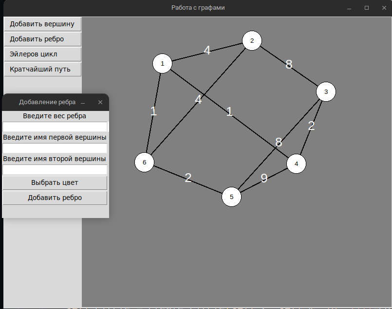

<p align="center"> Министерство образования Республики Беларусь</p>
<p align="center">Учреждение образования</p>
<p align="center">“Брестский Государственный технический университет”</p>
<p align="center">Кафедра ИИТ</p>
<br><br><br><br><br><br><br>
<p align="center">Лабораторная работа №3</p>
<p align="center">По дисциплине “Общая теория интеллектуальных систем”</p>
<p align="center">Тема: “Применение знаний алгоритмов для графов на практике”</p>
<br><br><br><br><br>
<p align="right">Выполнил:</p>
<p align="right">Студент 2 курса</p>
<p align="right">Группы ИИ-26</p>
<p align="right">Турич Д.А.</p>
<p align="right">Проверил:</p>
<p align="right">Ситковец Я.С.</p>
<br><br><br><br><br>
<p align="center">Брест 2024</p>

---

# Общее задание #
1. Разработать и реализовать программный продукт позволяющий
редактировать графовые конструкции различных видов и производить над
ними различные действия. Язык программирования - любой.

2. Редактор должен позволять (задания со **[\*]** являются необязательными):  
  a) одновременно работать с несколькими графами (MDI);  
  b) **[\*]** выделение одновременно нескольких элементов графа, копирование
выделенного фрагмента в clipboard и восстановление из него;  
  c) задавать имена графам;  
  d) сохранять и восстанавливать граф во внутреннем формате программы;  
  e) экспортировать и импортировать граф в текстовый формат (описание
см. ниже);  
  f) создавать, удалять, именовать, переименовывать, перемещать узлы;  
  g) создавать ориентированные и неориентированные дуги, удалять дуги;  
  h) добавлять, удалять и редактировать содержимое узла (содержимое в
виде текста и ссылки на файл);  
  i) задавать цвет дуги и узла, образ узла;  
  j) **[\*]** создавать и отображать петли;  
  k) **[\*]** создавать и отображать кратные дуги.

3. Программный продукт должен позволять выполнять следующие операции:  
  a) выводить информацию о графе:

 + количество вершин, дуг;
 + степени для всех вершин и для выбранной вершины;
 + матрицу инцидентности;
 + матрицу смежности;
 + является ли он деревом, полным, связанным, эйлеровым, **[\*]** планарным;

  b) поиск всех путей (маршрутов) между двумя узлами и кратчайших;  
  c) вычисление расстояния между двумя узлами;  
  d) вычисление диаметра, радиуса, центра графа;  
  e) **[\*]** вычисление векторного и декартово произведения двух графов;  
  f) **[\*]** раскраска графа;  
  g) нахождения эйлеровых, [*] гамильтоновых циклов;  
  h) **[\*]** поиск подграфа в графе, со всеми или некоторыми неизвестными
узлами;  
  i) **[\*]** поиск узла по содержимому;  
  j) **[\*]** объединение, пересечение, сочетание и дополнение графов;  
  k) **[\*]** приведение произвольного графа к определенному типу с
минимальными изменениями:

 + бинарное и обычное дерево;
 + полный граф;
 + планарный граф;
 + связанный граф;

4. Формат текстового представления графа:
<ГРАФ> ::= <ИМЯ ГРАФА> : UNORIENT | ORIENT ; <ОПИСАНИЕ УЗЛОВ> ;
<ОПИСАНИЕ СВЯЗЕЙ> .
<ИМЯ ГРАФА> ::= <ИДЕНТИФИКАТОР>
<ОПИСАНИЕ УЗЛОВ> ::= <ИМЯ УЗЛА> [ , <ИМЯ УЗЛА> …]
<ИМЯ УЗЛА> ::= <ИДЕНТИФИКАТОР>
<ОПИСАНИЕ СВЯЗЕЙ> ::= <ИМЯ УЗЛА> -> <ИМЯ УЗЛА> [ , <ИМЯ УЗЛА> …] ;
[<ОПИСАНИЕ СВЯЗЕЙ> …]

5. Написать отчет по выполненной лабораторной работе в .md формате (readme.md). Разместить его в следующем каталоге: **trunk\ii0xxyy\task_03\doc** (где **xx** - номер группы, **yy** - номер студента, например **ii02102**). 

6. Исходный код разработанной программы разместить в каталоге: **trunk\ii0xxyy\task_03\src**.

---

# Выполнение задания #
```С++
#include <iostream>
#include <vector>
#include <list>
#include <queue>
#include <unordered_set>

using namespace std;

class G {
private:
    struct N {
        int id;
        list<int> adjNodes;
    };

    vector<N> nodes;

    bool isE() const {
        for (const auto& node : nodes) {
            if (node.adjNodes.size() % 2 != 0) {
                return false;
            }
        }
        return true;
    }


    bool fH(int node, int depth, vector<int>& cycle, vector<bool>& visited) {
        if (depth == nodes.size()) {
            return cycle.front() == cycle.back();
        }

        for (int adj : nodes[node].adjNodes) {
            if (!visited[adj]) {
                visited[adj] = true;
                cycle[depth] = adj;
                if (fH(adj, depth + 1, cycle, visited)) {
                    return true;
                }
                visited[adj] = false;
            }
        }
        return false;
    }

public:

    void aN(int id) {
        nodes.push_back({ id, {} });
    }


    void aE(int start, int end) {
        nodes[start].adjNodes.push_back(end);
        nodes[end].adjNodes.push_back(start);
    }


    void sG() const {
        for (const auto& node : nodes) {
            cout << "Node " << node.id << ": ";
            for (int nei : node.adjNodes) {
                cout << nei << " ";
            }
            cout << endl;
        }
    }

    vector<int> gE() {
        vector<int> c;
        if (!isE()) return c;

        vector<bool> visited(nodes.size(), false);
        list<int> s;
        s.push_back(0);

        while (!s.empty()) {
            int cur = s.back();
            if (!nodes[cur].adjNodes.empty()) {
                int next = nodes[cur].adjNodes.front();
                s.push_back(next);
                nodes[cur].adjNodes.remove(next);
                nodes[next].adjNodes.remove(cur);
            }
            else {
                c.push_back(cur);
                s.pop_back();
            }
        }
        return c;
    }


    vector<int> gH() {
        vector<int> c(nodes.size(), -1);
        vector<bool> v(nodes.size(), false);
        v[0] = true;
        c[0] = 0;

        if (fH(0, 1, c, v)) {
            return c;
        }
        return {};
    }

    G getSpanningT() const {
        G sT;
        for (int i = 0; i < nodes.size(); ++i) {
            sT.aN(i);
        }

        vector<bool> v(nodes.size(), false);
        v[0] = true;
        queue<int> q;
        q.push(0);

        while (!q.empty()) {
            int cur = q.front();
            q.pop();

            for (int nei : nodes[cur].adjNodes) {
                if (!v[nei]) {
                    v[nei] = true;
                    sT.aE(cur, nei);
                    q.push(nei);
                }
            }
        }
        return sT;
    }
};

int main() {
    setlocale(LC_ALL, "RUSSIAN");
    G g;


    g.aN(0);
    g.aN(1);
    g.aN(2);
    g.aN(3);
    g.aN(4);


    g.aE(0, 1);
    g.aE(1, 2);
    g.aE(2, 3);
    g.aE(3, 4);
    g.aE(4, 0);

    cout << "Структура графа:\n";
    g.sG();

    vector<int> eC = g.gE();
    if (!eC.empty()) {
        cout << "Эйлеров цикл: ";
        for (int node : eC) {
            cout << node << " ";
        }
        cout << endl;
    }
    else {
        cout << "Эйлеров цикл не найден.\n";
    }
    vector<int> hC = g.gH();
    if (!hC.empty()) {
        cout << "Гамильтонов цикл: ";
        for (int node : hC) {
            cout << node << " ";
        }
        cout << endl;
    }
    else {
        cout << "Гамильтонов цикл не найден.\n";
    }
    G sT = g.getSpanningT();
    cout << "Создание структуры дерева:\n";
    sT.sG();

    return 0;
}

```





