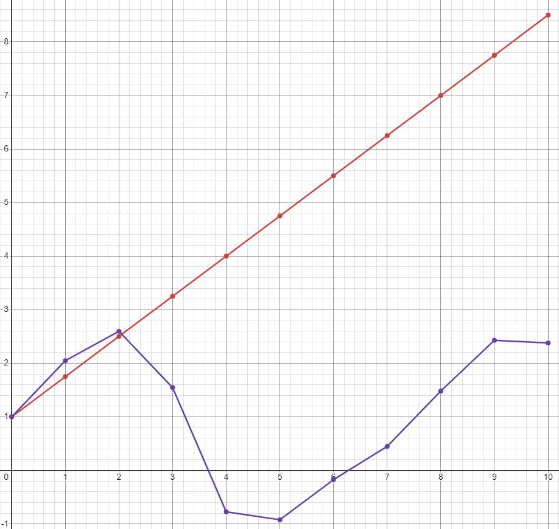

<p align="center"> Министерство образования Республики Беларусь</p>
<p align="center">Учреждение образования</p>
<p align="center">“Брестский Государственный технический университет”</p>
<p align="center">Кафедра ИИТ</p>
<br><br><br><br><br><br><br>
<p align="center">Лабораторная работа №1</p>
<p align="center">По дисциплине “Общая теория интеллектуальных систем”</p>
<p align="center">Тема: “Моделирования температуры объекта”</p>
<br><br><br><br><br>
<p align="right">Выполнил:</p>
<p align="right">Студент 2 курса</p>
<p align="right">Группы ИИ-26</p>
<p align="right">Хомиченко И. А.</p>
<p align="right">Проверила:</p>
<p align="right">Ситковец Я. С.</p>
<br><br><br><br><br>
<p align="center">Брест 2024</p>

<hr>

# Общее задание #
1. Написать отчет по выполненной лабораторной работе №1 в .md формате (readme.md) и с помощью запроса на внесение изменений (**pull request**) разместить его в следующем каталоге: **trunk\ii0xxyy\task_01\doc** (где **xx** - номер группы, **yy** - номер студента, например **ii02102**).
2. Исходный код написанной программы разместить в каталоге: **trunk\ii0xxyy\task_01\src**.
## Task 1. Modeling controlled object ##
Let's get some object to be controlled. We want to control its temperature, which can be described by this differential equation:

$$\Large\frac{dy(\tau)}{d\tau}=\frac{u(\tau)}{C}+\frac{Y_0-y(\tau)}{RC} $$ (1)

where $\tau$ – time; $y(\tau)$ – input temperature; $u(\tau)$ – input warm; $Y_0$ – room temperature; $C,RC$ – some constants.

After transformation, we get these linear (2) and nonlinear (3) models:

$$\Large y_{\tau+1}=ay_{\tau}+bu_{\tau}$$ (2)
$$\Large y_{\tau+1}=ay_{\tau}-by_{\tau-1}^2+cu_{\tau}+d\sin(u_{\tau-1})$$ (3)

where $\tau$ – time discrete moments ($1,2,3{\dots}n$); $a,b,c,d$ – some constants.

Task is to write program (**С++**), which simulates this object temperature.

<hr>

# Выполнение задания #

Код программы:
```#include <iostream>
#include <cmath>

using namespace std;

void linearModelSimulation(double paramA, double paramB, double initialTemp, double initialSignal, int steps) {
    double currentTemp = initialTemp;
    double controlSignal = initialSignal;

    cout << "Линейная модель:\n";
    for (int timeStep = 0; timeStep < steps; ++timeStep) {
        double newTemp = paramA * currentTemp + paramB * controlSignal;
        cout << "Шаг времени " << timeStep << ": Температура = " << newTemp << endl;
        currentTemp = newTemp;
    }
}

void nonlinearModelSimulation(double paramA, double paramB, double paramC, double paramD, double initialTemp, double initialSignal, int steps) {
    double previousTemp = initialTemp;
    double currentTemp = initialTemp;
    double controlSignal = initialSignal;

    cout << "\nНелинейная модель:\n";
    for (int timeStep = 0; timeStep < steps; ++timeStep) {
        double newTemp = paramA * currentTemp - paramB * previousTemp * previousTemp + paramC * controlSignal + paramD * sin(controlSignal);
        cout << "Шаг времени " << timeStep << ": Температура = " << newTemp << endl;
        currentTemp = newTemp;
        previousTemp = currentTemp;
    }
}

int main() {
    setlocale(LC_ALL, "Russian");

    double paramA, paramB, paramC, paramD;
    double initialTemp, initialSignal;
    int steps;

    cout << "Введите значение параметра a: ";
    cin >> paramA;

    cout << "Введите значение параметра b: ";
    cin >> paramB;

    cout << "Введите значение параметра c (для нелинейной модели): ";
    cin >> paramC;

    cout << "Введите значение параметра d (для нелинейной модели): ";
    cin >> paramD;

    cout << "Введите начальное значение температуры y0: ";
    cin >> initialTemp;

    cout << "Введите начальное значение управляющего сигнала u0: ";
    cin >> initialSignal;

    cout << "Введите количество шагов моделирования: ";
    cin >> steps;

    linearModelSimulation(paramA, paramB, initialTemp, initialSignal, steps);
    nonlinearModelSimulation(paramA, paramB, paramC, paramD, initialTemp, initialSignal, steps);

    return 0;
}
```     
```
AT ALL
Введите значение параметра a: 1
Введите значение параметра b: 0.03
Введите значение параметра c (для нелинейной модели): 0.5
Введите значение параметра d (для нелинейной модели): 0.6
Введите начальное значение температуры y0: 1
Введите начальное значение управляющего сигнала u0: 1
Введите количество шагов моделирования: 10
Линейная модель:
Шаг времени 0: Температура = 1.03
Шаг времени 1: Температура = 1.06
Шаг времени 2: Температура = 1.09
Шаг времени 3: Температура = 1.12
Шаг времени 4: Температура = 1.15
Шаг времени 5: Температура = 1.18
Шаг времени 6: Температура = 1.21
Шаг времени 7: Температура = 1.24
Шаг времени 8: Температура = 1.27
Шаг времени 9: Температура = 1.3

Нелинейная модель:
Шаг времени 0: Температура = 1.97488
Шаг времени 1: Температура = 2.94977
Шаг времени 2: Температура = 3.83764
Шаг времени 3: Температура = 4.58149
Шаг времени 4: Температура = 5.14455
Шаг времени 5: Температура = 5.51973
Шаг времени 6: Температура = 5.73062
Шаг времени 7: Температура = 5.82148
Шаг времени 8: Температура = 5.84116
Шаг времени 9: Температура = 5.82936

