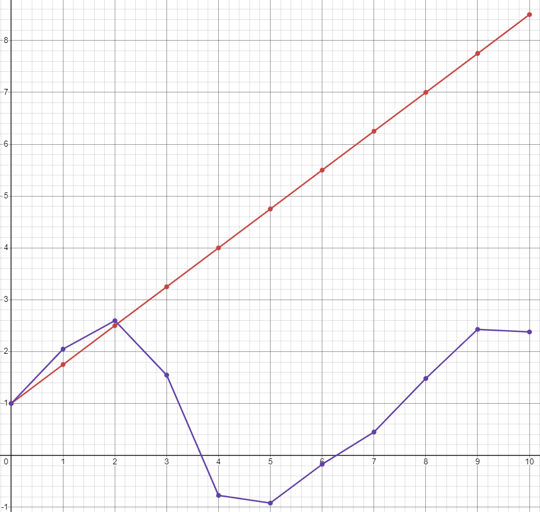

<p align="center"> Министерство образования Республики Беларусь</p>
<p align="center">Учреждение образования</p>
<p align="center">“Брестский Государственный технический университет”</p>
<p align="center">Кафедра ИИТ</p>
<br><br><br><br><br><br><br>
<p align="center">Лабораторная работа №1</p>
<p align="center">По дисциплине “Общая теория интеллектуальных систем”</p>
<p align="center">Тема: “Моделирования температуры объекта”</p>
<br><br><br><br><br>
<p align="right">Выполнил:</p>
<p align="right">Студент 2 курса</p>
<p align="right">Группы ИИ-26</p>
<p align="right">Шарубнёв Д. С.</p>
<p align="right">Проверил:</p>
<p align="right">Иванюк Д. С.</p>
<br><br><br><br><br>
<p align="center">Брест 2024</p>

<hr>

# Общее задание #
1. Написать отчет по выполненной лабораторной работе №1 в .md формате (readme.md) и с помощью запроса на внесение изменений (**pull request**) разместить его в следующем каталоге: **trunk\ii0xxyy\task_01\doc** (где **xx** - номер группы, **yy** - номер студента, например **ii02102**).
2. Исходный код написанной программы разместить в каталоге: **trunk\ii0xxyy\task_01\src**.
## Task 1. Modeling controlled object ##
Let's get some object to be controlled. We want to control its temperature, which can be described by this differential equation:

$$\Large\frac{dy(\tau)}{d\tau}=\frac{u(\tau)}{C}+\frac{Y_0-y(\tau)}{RC} $$ (1)

where $\tau$ – time; $y(\tau)$ – input temperature; $u(\tau)$ – input warm; $Y_0$ – room temperature; $C,RC$ – some constants.

After transformation, we get these linear (2) and nonlinear (3) models:

$$\Large y_{\tau+1}=ay_{\tau}+bu_{\tau}$$ (2)
$$\Large y_{\tau+1}=ay_{\tau}-by_{\tau-1}^2+cu_{\tau}+d\sin(u_{\tau-1})$$ (3)

where $\tau$ – time discrete moments ($1,2,3{\dots}n$); $a,b,c,d$ – some constants.

Task is to write program (**Julia**), which simulates this object temperature.

<hr>

# Выполнение задания #

Код программы:
```C++
#include<iostream>
#include<cmath>

using namespace std;

double a = 1.0, 
b = 0.5, 
c = 0.1, 
d = 0.9, 
u = 1.5;

void liner_model(double& y0)
{
	y0 = a * y0 + b * u;
	cout << "|" << y0  << endl;
}

void unliner_model(double& y00, double& y01,bool& first)
{
	if (first) {
		y01 = y00;
		y00 = a * y00 + c * u + d * sin(u);
		first = false; // первая итерция закончена
		cout << "|" << y00 << endl;
	}
	else {
		double vr = 0; // переменная для хранения значения новой температуры 
		vr = a*y00 -b*pow(y01,2) + c * u + d * sin(u);
		y01 = y00; //устанавливаем новое значение для преведущего значения у
		y00 = vr;//устанавливаем новое значение для текущего значения у
		cout << "|" << y00 << endl;
	}
}


int main(){
	setlocale(LC_ALL, "rus");
	double y0 = 0, y00 = 0, y_01= 0; // переменная y0 и у00 это начальные значения температуры для линейной и нелинейной модели, у_01 - это пред. значение в нелинейной модели
	bool first = true; //используется для определения первой итерации в функции нелинейной модели 
	cout << "Введите начальную температуру:";
	cin >> y0;
	y00 = y0;
	int N = 10;
	cout << "линейная модель:" << endl;
	for (int i = 0; i < N; i++) {
		liner_model(y0);
	}
	cout << "нелинейная модель:" << endl;
	for (int i = 0; i < N; i++) {
		unliner_model(y00,y_01,first);
	}
	return 0;
}
```     
```
Введите начальную температуру:1
линейная модель:
|1.75
|2.5
|3.25
|4
|4.75
|5.5
|6.25
|7
|7.75
|8.5
нелинейная модель:
|2.04775
|2.59549
|1.54661
|-0.773936
|-0.922185
|-0.173927
|0.448606
|1.48123
|2.42835
|2.37908
```

