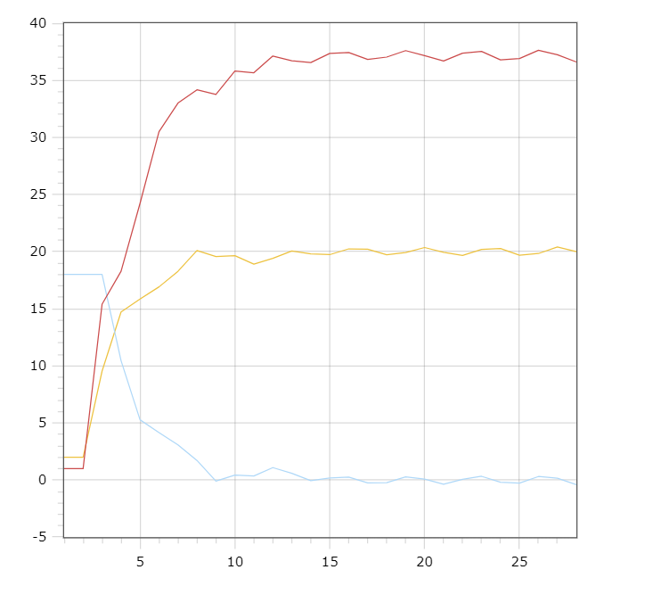

<p align="center"> Министерство образования Республики Беларусь</p>
<p align="center">Учреждение образования</p>
<p align="center">“Брестский Государственный технический университет”</p>
<p align="center">Кафедра ИИТ</p>
<br><br><br><br><br><br><br>
<p align="center">Лабораторная работа №1</p>
<p align="center">По дисциплине “Общая теория интеллектуальных систем”</p>
<p align="center">Тема: “ПИД-регуляторы”</p>
<br><br><br><br><br>
<p align="right">Выполнил:</p>
<p align="right">Студент 2 курса</p>
<p align="right">Группы ИИ-26</p>
<p align="right">Шарубнёв Д. С.</p>
<p align="right">Проверил:</p>
<p align="right">Иванюк Д. С.</p>
<br><br><br><br><br>
<p align="center">Брест 2024</p>

<hr>

# Общее задание #
1. Написать отчет по выполненной лабораторной работе №1 в .md формате (readme.md) и с помощью запроса на внесение изменений (**pull request**) разместить его в следующем каталоге: **trunk\ii0xxyy\task_01\doc** (где **xx** - номер группы, **yy** - номер студента, например **ii02102**).
2. Исходный код написанной программы разместить в каталоге: **trunk\ii0xxyy\task_01\src**.
## Task 1. Modeling controlled object ##
Let's get some object to be controlled. We want to control its temperature, which can be described by this differential equation:

$$\Large\frac{dy(\tau)}{d\tau}=\frac{u(\tau)}{C}+\frac{Y_0-y(\tau)}{RC} $$ (1)

where $\tau$ – time; $y(\tau)$ – input temperature; $u(\tau)$ – input warm; $Y_0$ – room temperature; $C,RC$ – some constants.

After transformation, we get these linear (2) and nonlinear (3) models:

$$\Large y_{\tau+1}=ay_{\tau}+bu_{\tau}$$ (2)
$$\Large y_{\tau+1}=ay_{\tau}-by_{\tau-1}^2+cu_{\tau}+d\sin(u_{\tau-1})$$ (3)

where $\tau$ – time discrete moments ($1,2,3{\dots}n$); $a,b,c,d$ – some constants.

Task is to write program (**Julia**), which simulates this object temperature.

<hr>

# Выполнение задания #

Код программы:
```C++
#include <iostream>
#include <cmath>
#include <vector>

using namespace std;

const double k = 0.001;//коэф. передачи
const double t = 50;//постоянная интегрирования
const double td = 100;//постоянная дифференцирования
const double t0 = 1;//шаг
const double a = 0.4;
const double b = 0.4;
const double c = 0.4;
const double d = 0.4;

void nelineyn(double znach) {
    double q0 = k * (1 + td / t0);
    double q1 = -k * (1 + 2 * td / t0 - t0 / t);
    double q2 = k * td / t0;
    vector<double> y = { 0, 0, 0 };
    vector<double> u = { 1, 1 };
    for (int i = 0; i < t; i++) {
        double e0 = znach - y[y.size() - 1];
        double e1 = znach - y[y.size() - 2];
        double e2 = znach - y[y.size() - 3];
        double intsum = q0 * e0 + q1 * e1 + q2 * e2;
        u[0] = u[1] + intsum;
        u[1] = u[0];
        y.push_back(a * y[y.size() - 1] - b * y[y.size() - 2] * y[y.size() - 2] + c * u[0] + d * sin(u[1]));
    }
    for (double i : y) {
        double res = i * znach / y[y.size() - 1];
        cout << res << endl;
    }
}

int main() {
    setlocale(LC_ALL, "RUS");
    double znach;
    cout << "Желаемое начальное значение: ";
    cin >> znach;
    nelineyn(znach);
    return 0;
}
```     
```
Желаемое начальное значение: 1
0
0
0
0.920529
1.23033
1.12147
0.890637
0.887851
1.02142
1.06793
1.01027
0.962558
0.981251
1.01476
1.0156
0.996545
0.989618
0.998378
1.00532
1.00263
0.997702
0.997603
1.00042
1.00144
1.00015
0.999134
0.999538
1.00027
1.00028
0.999868
0.999723
0.999916
1.00007
1.00001
0.999907
0.999908
0.999971
0.999995
0.99997
0.99995
0.999962
0.99998
0.999982
0.999976
0.999975
0.999982
0.999988
0.999989
0.999989
0.999991
0.999995
0.999998
1
```

