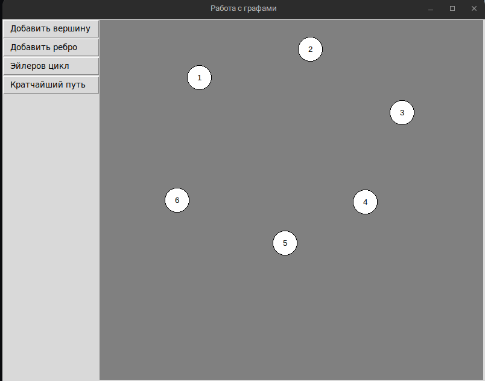

<p align="center"> Министерство образования Республики Беларусь</p>
<p align="center">Учреждение образования</p>
<p align="center">“Брестский Государственный технический университет”</p>
<p align="center">Кафедра ИИТ</p>
<br><br><br><br><br><br><br>
<p align="center">Лабораторная работа №3</p>
<p align="center">По дисциплине “Общая теория интеллектуальных систем”</p>
<p align="center">Тема: “Применение знаний алгоритмов для графов на практике”</p>
<br><br><br><br><br>
<p align="right">Выполнил:</p>
<p align="right">Студент 2 курса</p>
<p align="right">Группы ИИ-26</p>
<p align="right">Пасевич К.Ю.</p>
<p align="right">Проверил:</p>
<p align="right">Иванюк Д. С.</p>
<br><br><br><br><br>
<p align="center">Брест 2024</p>

---

# Общее задание #
1. Разработать и реализовать программный продукт позволяющий
редактировать графовые конструкции различных видов и производить над
ними различные действия. Язык программирования - любой.

2. Редактор должен позволять (задания со **[\*]** являются необязательными):  
  a) одновременно работать с несколькими графами (MDI);  
  b) **[\*]** выделение одновременно нескольких элементов графа, копирование
выделенного фрагмента в clipboard и восстановление из него;  
  c) задавать имена графам;  
  d) сохранять и восстанавливать граф во внутреннем формате программы;  
  e) экспортировать и импортировать граф в текстовый формат (описание
см. ниже);  
  f) создавать, удалять, именовать, переименовывать, перемещать узлы;  
  g) создавать ориентированные и неориентированные дуги, удалять дуги;  
  h) добавлять, удалять и редактировать содержимое узла (содержимое в
виде текста и ссылки на файл);  
  i) задавать цвет дуги и узла, образ узла;  
  j) **[\*]** создавать и отображать петли;  
  k) **[\*]** создавать и отображать кратные дуги.

3. Программный продукт должен позволять выполнять следующие операции:  
  a) выводить информацию о графе:

 + количество вершин, дуг;
 + степени для всех вершин и для выбранной вершины;
 + матрицу инцидентности;
 + матрицу смежности;
 + является ли он деревом, полным, связанным, эйлеровым, **[\*]** планарным;

  b) поиск всех путей (маршрутов) между двумя узлами и кратчайших;  
  c) вычисление расстояния между двумя узлами;  
  d) вычисление диаметра, радиуса, центра графа;  
  e) **[\*]** вычисление векторного и декартово произведения двух графов;  
  f) **[\*]** раскраска графа;  
  g) нахождения эйлеровых, [*] гамильтоновых циклов;  
  h) **[\*]** поиск подграфа в графе, со всеми или некоторыми неизвестными
узлами;  
  i) **[\*]** поиск узла по содержимому;  
  j) **[\*]** объединение, пересечение, сочетание и дополнение графов;  
  k) **[\*]** приведение произвольного графа к определенному типу с
минимальными изменениями:

 + бинарное и обычное дерево;
 + полный граф;
 + планарный граф;
 + связанный граф;

4. Формат текстового представления графа:
<ГРАФ> ::= <ИМЯ ГРАФА> : UNORIENT | ORIENT ; <ОПИСАНИЕ УЗЛОВ> ;
<ОПИСАНИЕ СВЯЗЕЙ> .
<ИМЯ ГРАФА> ::= <ИДЕНТИФИКАТОР>
<ОПИСАНИЕ УЗЛОВ> ::= <ИМЯ УЗЛА> [ , <ИМЯ УЗЛА> …]
<ИМЯ УЗЛА> ::= <ИДЕНТИФИКАТОР>
<ОПИСАНИЕ СВЯЗЕЙ> ::= <ИМЯ УЗЛА> -> <ИМЯ УЗЛА> [ , <ИМЯ УЗЛА> …] ;
[<ОПИСАНИЕ СВЯЗЕЙ> …]

5. Написать отчет по выполненной лабораторной работе в .md формате (readme.md). Разместить его в следующем каталоге: **trunk\ii0xxyy\task_03\doc** (где **xx** - номер группы, **yy** - номер студента, например **ii02102**). 

6. Исходный код разработанной программы разместить в каталоге: **trunk\ii0xxyy\task_03\src**.

---

# Выполнение задания #
```С++
#include <iostream>
#include <queue>
#include <vector>
using namespace std;

struct Node {
    int id;
    vector<int> edges;
};

class Graph {
public:
    vector<Node> nodes;

    void addNode(int id) {
        nodes.push_back({ id, {} });
    }

    void addEdge(int startNode, int endNode) {
        nodes[startNode].edges.push_back(endNode);
        nodes[endNode].edges.push_back(startNode);
    }

    void displayGraph() {
        for (int index = 0; index < nodes.size(); ++index) {
            cout << "Node " << nodes[index].id << ": ";
            for (int neighbor : nodes[index].edges) {
                cout << neighbor << " ";
            }
            cout << endl;
        }
    }

    vector<int> getEulerianPath() {
        vector<int> eulerPath;
        if (!isEulerian()) {
            return eulerPath;
        }
        vector<bool> visitedNodes(nodes.size(), false);
        int startNode = 0;
        eulerPath.push_back(startNode);
        visitedNodes[startNode] = true;

        int currentNode = startNode;
        while (!eulerPath.empty()) {
            bool foundNeighbor = false;
            for (int i = 0; i < nodes[currentNode].edges.size(); ++i) {
                int neighbor = nodes[currentNode].edges[i];
                if (!visitedNodes[neighbor]) {
                    foundNeighbor = true;
                    visitedNodes[neighbor] = true;
                    currentNode = neighbor;
                    eulerPath.push_back(currentNode);
                    break;
                }
            }
            if (!foundNeighbor) {
                eulerPath.pop_back();
                if (!eulerPath.empty()) {
                    currentNode = eulerPath.back();
                }
            }
        }
        return eulerPath;
    }

    vector<int> getHamiltonianPath() {
        vector<int> hamiltonPath;
        vector<bool> visitedNodes(nodes.size(), false);
        visitedNodes[0] = true;
        hamiltonPath.push_back(0);

        if (!searchHamiltonianPath(0, 1, hamiltonPath, visitedNodes)) {
            return {};
        }
        return hamiltonPath;
    }

    Graph createSpanningTree() {
        Graph spanningTree;
        for (int i = 0; i < nodes.size(); ++i) {
            spanningTree.addNode(i);
        }
        vector<bool> visitedNodes(nodes.size(), false);
        visitedNodes[0] = true;

        queue<int> nodeQueue;
        nodeQueue.push(0);
        while (!nodeQueue.empty()) {
            int currentNode = nodeQueue.front();
            nodeQueue.pop();
            for (int neighbor : nodes[currentNode].edges) {
                if (!visitedNodes[neighbor]) {
                    spanningTree.addEdge(currentNode, neighbor);
                    visitedNodes[neighbor] = true;
                    nodeQueue.push(neighbor);
                }
            }
        }
        return spanningTree;
    }

private:
    bool isEulerian() {
        for (int i = 0; i < nodes.size(); ++i) {
            if (nodes[i].edges.size() % 2 != 0) {
                return false;
            }
        }
        return true;
    }

    bool searchHamiltonianPath(int currentNode, int depth, vector<int>& hamiltonPath, vector<bool>& visitedNodes) {
        if (depth == nodes.size()) {
            return hamiltonPath[0] == currentNode;
        }
        for (int neighbor : nodes[currentNode].edges) {
            if (!visitedNodes[neighbor]) {
                visitedNodes[neighbor] = true;
                hamiltonPath.push_back(neighbor);
                if (searchHamiltonianPath(neighbor, depth + 1, hamiltonPath, visitedNodes)) {
                    return true;
                }
                hamiltonPath.pop_back();
                visitedNodes[neighbor] = false;
            }
        }
        return false;
    }
};

int main() {
    setlocale(LC_ALL, "rus");
    Graph graph;
    graph.addNode(0);
    graph.addNode(1);
    graph.addNode(2);
    graph.addNode(3);
    graph.addNode(4);
    graph.addEdge(0, 1);
    graph.addEdge(1, 2);
    graph.addEdge(2, 3);
    graph.addEdge(3, 4);
    graph.addEdge(4, 0);

    graph.displayGraph();

    vector<int> eulerianPath = graph.getEulerianPath();
    if (!eulerianPath.empty()) {
        cout << "Эйлеров путь: ";
        for (int node : eulerianPath) {
            cout << node << " ";
        }
        cout << endl;
    }
    else {
        cout << "Граф не содержит эйлерова пути." << endl;
    }

    vector<int> hamiltonianPath = graph.getHamiltonianPath();
    if (!hamiltonianPath.empty()) {
        cout << "Гамильтонов путь: ";
        for (int node : hamiltonianPath) {
            cout << node << " ";
        }
        cout << endl;
    }
    else {
        cout << "Граф не содержит гамильтонова пути." << endl;
    }

    Graph spanningTree = graph.createSpanningTree();
    spanningTree.displayGraph();

    return 0;
}
```





