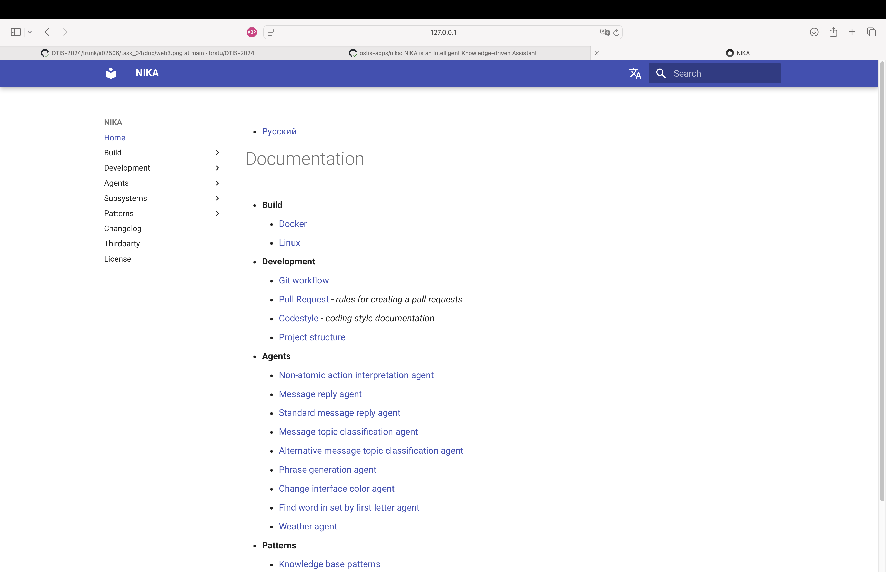
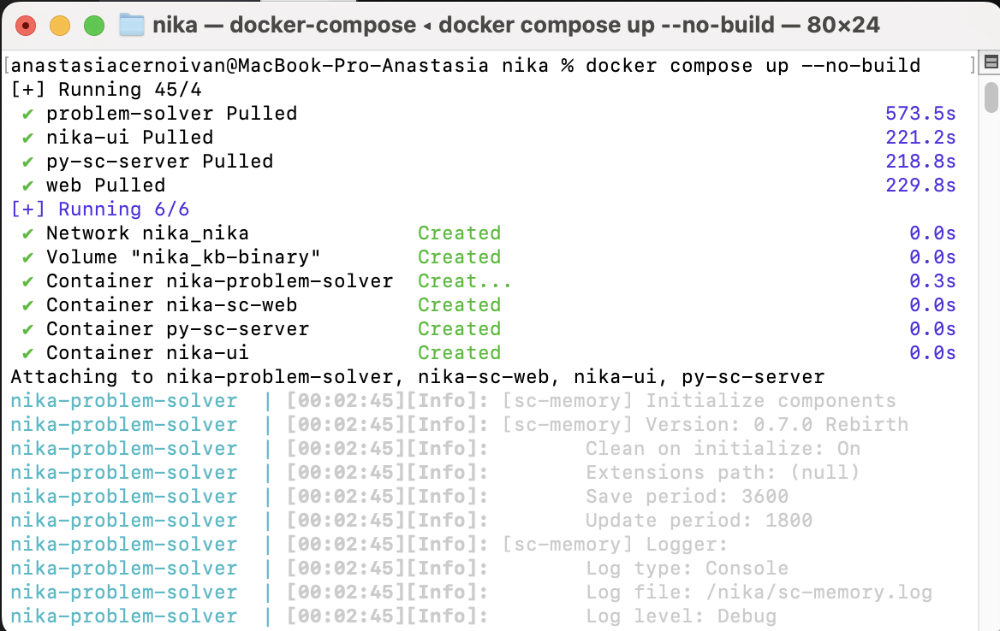
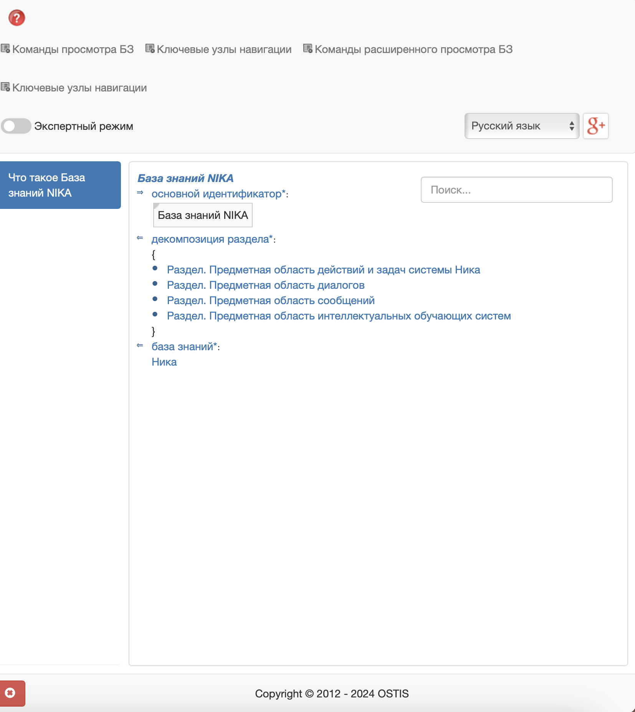
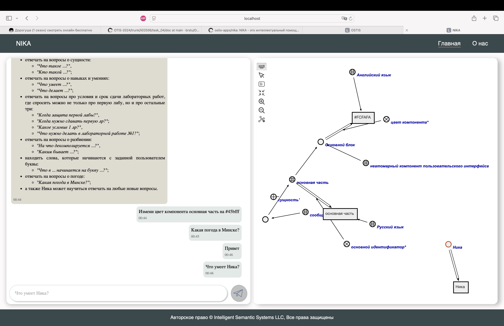

<p align="center"> Министерство образования Республики Беларусь</p>
<p align="center">Учреждение образования</p>
<p align="center">“Брестский Государственный технический университет”</p>
<p align="center">Кафедра ИИТ</p>
<br><br><br><br><br><br><br>
<p align="center">Лабораторная работа №4</p>
<p align="center">По дисциплине “Общая теория интеллектуальных систем”</p>
<p align="center">Тема: “Работа с проектом "NIKA" (Intelligent Knowledge-driven Assistant)”</p>
<br><br><br><br><br>
<p align="right">Выполнила:</p>
<p align="right">Студентка 2 курса</p>
<p align="right">Группы ИИ-26</p>
<p align="right">Черноиван А.Н.</p>
<p align="right">Проверила:</p>
<p align="right">Ситковец Я. С.</p>
<br><br><br><br><br>
<p align="center">Брест 2024</p>

---

# Работа с проектом **"NIKA"** (Intelligent Knowledge-driven Assistant) #

1. Изучить [руководство](https://github.com/ostis-apps/nika).

2. Запустить данный проект на локальной машине (домашний персональный компьютер, ноутбук, рабочая машина в аудитории и т.п.). Продемонстрировать работу проекта преподавателю.

3. Написать отчет по выполненной работе в .md формате (report.md) и с помощью pull request разместить его в следующем каталоге: trunk\ii0xxyy\task_04\doc.

---

# Выполнение задания

установка 


Документация Nika:




запуск

```
docker compose up --no-build
```


Итерфейс 1
localhost:8000



Итерфейс 2
localhost:3033


