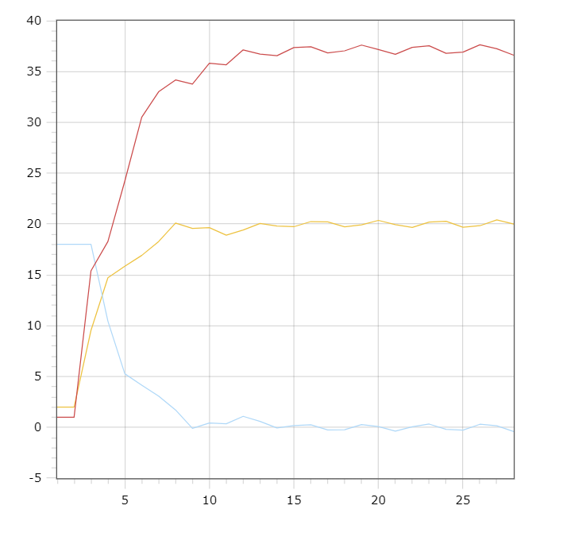

<p align="center"> Министерство образования Республики Беларусь</p>
<p align="center">Учреждение образования</p>
<p align="center">“Брестский Государственный технический университет”</p>
<p align="center">Кафедра ИИТ</p>
<br><br><br><br><br><br><br>
<p align="center">Лабораторная работа №1</p>
<p align="center">По дисциплине “Общая теория интеллектуальных систем”</p>
<p align="center">Тема: “ПИД-регуляторы”</p>
<br><br><br><br><br>
<p align="right">Выполнил:</p>
<p align="right">Студент 2 курса</p>
<p align="right">Группы ИИ-26</p>
<p align="right">Шарубнёв Д. С.</p>
<p align="right">Проверил:</p>
<p align="right">Иванюк Д. С.</p>
<br><br><br><br><br>
<p align="center">Брест 2024</p>

<hr>

# Общее задание #
1. Написать отчет по выполненной лабораторной работе №1 в .md формате (readme.md) и с помощью запроса на внесение изменений (**pull request**) разместить его в следующем каталоге: **trunk\ii0xxyy\task_02\doc** (где **xx** - номер группы, **yy** - номер студента, например **ii02302**).
2. Исходный код написанной программы разместить в каталоге: **trunk\ii0xxyy\task_02\src**.

# Задание #
Задание. На C++ реализовать программу, моделирующую рассмотренный выше ПИД-регулятор. В качестве объекта управления использовать математическую модель, полученную в предыдущей работе. В отчете также привести графики для разных заданий температуры объекта, пояснить полученные результаты.
---
# Код программы: #
```C++
#include <iostream>
#include <cmath>
#include <vector>

using namespace std;

const double gain = 0.001; // Коэффициент передачи
const double integration_constant = 50; // Постоянная интегрирования
const double differentiation_constant = 100; // Постоянная дифференцирования
const double step = 1; // Шаг
const double a_coefficient = 0.4;
const double b_coefficient = 0.4;
const double c_coefficient = 0.4;
const double d_coefficient = 0.4;

void non_linear_system(double desired_value) {
    double q0 = gain * (1 + differentiation_constant / step);
    double q1 = -gain * (1 + 2 * differentiation_constant / step - step / integration_constant);
    double q2 = gain * differentiation_constant / step;
    vector<double> output_values = { 0, 0, 0 };
    vector<double> control_signals = { 1, 1 };

    for (int i = 0; i < integration_constant; i++) {
        double error0 = desired_value - output_values[output_values.size() - 1];
        double error1 = desired_value - output_values[output_values.size() - 2];
        double error2 = desired_value - output_values[output_values.size() - 3];
        double integral_sum = q0 * error0 + q1 * error1 + q2 * error2;
        control_signals[0] = control_signals[1] + integral_sum;
        control_signals[1] = control_signals[0];
        output_values.push_back(a_coefficient * output_values[output_values.size() - 1] -
                                b_coefficient * output_values[output_values.size() - 2] * output_values[output_values.size() - 2] +
                                c_coefficient * control_signals[0] +
                                d_coefficient * sin(control_signals[1]));
    }

    for (double value : output_values) {
        double result = value * desired_value / output_values[output_values.size() - 1];
        cout << result << endl;
    }
}

int main() {
    setlocale(LC_ALL, "RUS");
    double desired_value;
    cout << "Желаемое начальное значение: ";
    cin >> desired_value;
    non_linear_system(desired_value);
    return 0;
}
```     
```
Желаемое начальное значение: 0.1
0
0
0
0.0921037
0.123099
0.112206
0.0891094
0.08883
0.102193
0.106844
0.101074
0.0963006
0.0981692
0.101519
0.101602
0.099696
0.0990021
0.0998769
0.10057
0.1003
0.0998062
0.0997951
0.100076
0.100176
0.100046
0.0999437
0.0999829
0.100054
0.100055
0.100013
0.0999969
0.100015
0.100029
0.100022
0.100011
0.10001
0.100015
0.100016
0.100013
0.10001
0.10001
0.10001
0.100009
0.100008
0.100006
0.100006
0.100005
0.100004
0.100003
0.100002
0.100002
0.100001
0.1
```

